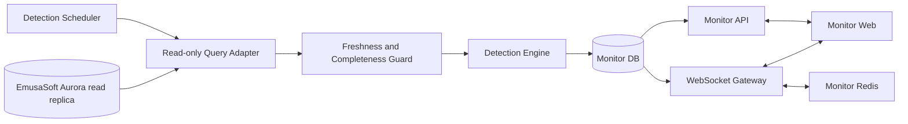

# Monitor: EmusaSoft Integration Architecture and Production Roadmap

> **Scope:** This document governs architecture and technical sequencing within the product defined in `docs/product_definition.md`. Technical phases are not product releases and do not redefine the four main screens.

**System:** Monitor — Dashboard, Chats, Errors, and Alerts

**Version:** 1.2

**Status:** Archived on 2026-07-22; superseded by Version 2.0

**Analysis date:** 2026-07-21

**Primary sources:** EmusaSoft MCP catalog, production MySQL schema extracted on 2026-07-16, workspace documentation and prototypes, and EmusaSoft architect answers through 2026-07-20
**Not included:** EmusaSoft changes or real EmusaSoft integration before Phase 10

## 1. Architecture decision summary

Monitor must be built as a separate application and service integrated with EmusaSoft, not as logic embedded directly in the ERP production database.

The confirmed target architecture is:

1. Monitor is a new system with its own repository, deployment, and control database.
2. The EmusaSoft database is an external, read-only operational source. Monitor never writes to it.
3. EmusaSoft provides no SSE service to Monitor. EmusaSoft's internal Redis is not an integration boundary.
4. Monitor runs approved condition-based SQL detection queries against an Aurora MySQL read replica.
5. A Monitor-owned scheduler runs each query at a versioned per-alert interval. Local limits are measured against protected sample data; production limits are approved during Phase 10.
6. A source-freshness guard prevents failed, partial, invalid, or stale cycles from resolving incidents.
7. Monitor's database stores query definitions, condition state, incident occurrences, temporary suppressions, evidence, conversations, messages, receipts, deliveries, client synchronization state, and audit history.
8. Monitor uses WebSockets for bidirectional client communication, including messages, read receipts, presence, typing, and dashboard updates.
9. Monitor's Redis coordinates fan-out, presence, and horizontal WebSocket scaling. The database—not Redis—is the source of truth for messages and incidents.
10. A Monitor API serves queries, history recovery, and persistent commands. WebSockets distribute committed changes and ephemeral signals.
11. Operational records are corrected in EmusaSoft. Monitor shows their ERP identifiers and later observes the correction; no supported EmusaSoft frontend-route contract currently exists.
12. Monitor provides a read-only view of every `CLOSED_WITHOUT_RESOLUTION` incident, including evidence, reason, administrator, and operational references.
13. Inventory, valued-kardex, and accounting adjustments are outside Monitor. Monitor never schedules, requests, tracks, or applies adjustments and never receives EmusaSoft write credentials.

### Technical strategy

**Diagnosis:** EmusaSoft owns the operational record but provides no Monitor-specific event stream. Monitor must derive alert conditions safely from approved read-only queries without overloading the ERP replica, resolving incidents from incomplete data, or confusing source timestamps with first detection. It must preserve evidence and support bidirectional conversations as an independent system.

**Guiding policies:** one source of truth per domain; writes only to Monitor's database; approved bounded reads from EmusaSoft; no adjustment or document-request integration; condition polling for ERP input; WebSockets for client interaction; healthy-cycle proof before automatic resolution; persist before publishing; keep queries, detectors, and commands idempotent, versioned, and explainable; deliver deterministic rules first.

**Actions:** formalize detection-query, replica-freshness, read-only access, navigation, and WebSocket contracts; build and harden the complete system locally with mock identity, fixtures, and protected sample databases; then integrate real EmusaSoft authentication, Aurora reads, staging, pilot, and production in Phase 10. Phase 0 selected the concrete kit in `docs/phase0/adrs/0003-technical-kit.md` and recorded every gate item in `docs/phase0/README.md`.

## 2. Confidence levels

- **Confirmed:** directly visible in the SQL dump, MCP catalog, approved documentation, or architect answers.
- **Inferred:** a reasonable technical conclusion based on direct evidence without access to the implementing source file.
- **Pending:** cannot be confirmed from the available sources.

The MCP does not expose repository files, dependencies, modules, controllers, resolvers, or deployment infrastructure. It exposes a generated GraphQL catalog, entities, SQL tables, and examples. Its catalog is useful for discovery but is currently behind the extracted database and cannot alone prove a production query. The architect confirmed an Aurora MySQL read replica, condition-based SQL polling, independent Monitor ownership, and read-only access. Real credentials, freshness access, load limits, identity, current-schema validation, and runtime details are deferred to Phase 10. The architect reports no supported frontend route patterns; GraphQL operations must not be treated as browser links.

**Current precedence:** the product decision dated 2026-07-19 removes the adjustment queue and every regularization API. Detection rules and evidence remain governed by the active alert catalog; unresolved closures remain a read-only Monitor view.

## 3. Sources inspected

### 3.1 EmusaSoft MCP

Catalog version 2, generated on 2026-07-13T08:16:37Z:

- 1,034 GraphQL operations;
- 345 entities;
- 345 cataloged SQL tables; and
- 1,034 examples.

MCP surfaces used:

- `erp_get_catalog_info`
- `erp_search`
- `erp_describe`
- `erp_get_example`
- `erp_validate_graphql`
- `erp_run_graphql`

The 2026-07-19 verification successfully executed an authenticated read-only `getUserContext` query. Catalog-backed validation returned `schema unavailable`; restoring the validator and regenerating the drifted catalog are assigned to the MCP implementation team in `docs/emusasoft_preimplementation_requests.md`.

Representative operations inspected:

- identity and permissions: `getUserContext`, `getSysUserById`, `getUsers`, `getRolesByUser`, `getPermissionsByUserOrGroup`;
- document participation: `getAvailableDocumentUsers`, `getDocumentResponsibleUsers`, `notifyUsersInDocument`;
- comments and reads: `getSysCommentUsersByCommentId`, `createSysCommentUser`, `addSysReadUser`;
- presence: `pingActiveUser`, `updateStateUser`;
- production: `getWorkOrder`, `getWorkOrderClosureById`, `getWorkOrdersWithActiveFinalProcess`, `getWorkProduction`;
- materials: `getWorkOrderMaterialStocksById`, `getWorkOrderMaterialStockContainersConsumed`.

Representative entities inspected:

- `Document`, `SysUser`, `WorkProduction`, `WorkOrder`;
- `WorkOrderMaterialStock`, `WorkOrderMaterialStockContainer`;
- `MaterialFlow`, `MaterialFlowDetail`, `ArticleSerial`, `ScaleLoad`;
- `Warehouse`, `Equipment`, `ProductionSerial`.

### 3.2 Extracted database

File: `local-data/database/prod_emusa_core-20260716-143040.sql`

- MySQL 8.0.45 dump from a MySQL 8.0.43 production server;
- database: `prod_emusa_core`;
- source: production RDS MySQL in `us-east-1`;
- predominant charset and collation: `utf8mb4` and `utf8mb4_unicode_ci`;
- 363 `CREATE TABLE` statements;
- 361 primary keys, 179 unique indexes, 718 secondary indexes, and 803 foreign-key constraints;
- no observed `CREATE VIEW`, `CREATE TRIGGER`, `CREATE PROCEDURE`, `CREATE FUNCTION`, or `CREATE EVENT` definitions;
- tables without formal primary keys: `centro_costo_usuario` and `documento_relaciones`, both with composite indexes.

The dump contains 18 more tables than the MCP catalog. The most likely cause is drift between the catalog generated on 2026-07-13 and the dump produced on 2026-07-16. Regenerate the catalog or validate each operation against the current schema before building adapters.

### 3.3 Workspace documentation and UX/UI

Active sources:

- `docs/product_definition.md`
- `docs/alert_catalog.md`
- `docs/ux_ui_decisions.md`
- `docs/design/design.md`
- `docs/design/brand_guidelines.md`
- `docs/design/design-system/tokens.json`
- `docs/emusasoft_integration_architecture.md`
- `docs/emusasoft_preimplementation_requests.md`
- `prototype/alert-catalog/final/index.html`
- `prototype/chat-list-review/chat-list-final.html`
- `prototype/chat-list-review/chat-detail.html`
- `prototype/chat-list-review/dashboard.html`

Deprecated historical sources:

- `docs/archive/project_context.md`
- `docs/archive/dashboard_rationale.md`
- `docs/archive/discovery.md`
- `docs/archive/emusasoft_architecture_decisions.md`
- `prototype/dashboard/`
- `prototype/alert-catalog/v1/` through `v10/`

## 4. Observable EmusaSoft architecture

### 4.1 Confirmed layers

| Layer | Evidence | Conclusion |
|---|---|---|
| Web client | ERP routes, Emusa UI Storybook, and existing prototypes | EmusaSoft is a modular web application. |
| API contract | 1,034 GraphQL operations and generated examples | GraphQL is the main observable ERP interface. |
| Domain model | 345 GraphQL entities | The API exposes broad relational entities, not only flat DTOs. |
| Persistence | MySQL 8 dump with 363 tables | MySQL is the observed primary system of record. |
| ORM and migrations | `_prisma_migrations` | Prisma manages at least part of the schema. |
| Authorization | `sys_*` tables, resources, groups, roles, permissions, and matrices | Access combines RBAC, grouping, and resource-level control. |
| Documents and workflows | `documentos`, types, states, stages, assignees, and logs | A cross-cutting document and workflow core exists. |
| Outbound communication | `mensaje_flujos`, `mensaje_plantillas`, `notifyUsersInDocument` | EmusaSoft has template-based multichannel notification capabilities. |
| Comments and reads | `sys_comentarios`, `sys_comentario_usuarios`, `sys_lecturas`, `sys_lectura_usuarios` | Reusable comment and read-receipt primitives exist. |
| Presence | `SysUser.state`, `pingActiveUser`, `updateStateUser` | The API models available, paused, and disconnected users. |

### 4.2 Not confirmed

- exact backend framework or repository topology;
- actual service boundaries;
- exact Redis topology and channel ownership;
- approved detection queries, query plans, natural keys, result bounds, and polling intervals;
- identity provider and login protocol;
- deployment, container, ingress, load-balancer, and autoscaling topology;
- caches, queues, jobs, and scheduler;
- observability providers;
- concrete replica credentials, freshness signal, load budget, and permitted schemas; and
- Monitor WebSocket gateway technology.

No GraphQL `subscription` operation or catalog result for `websocket`, `socket`, `realtime`, or `subscription` was found. The EmusaSoft architect subsequently confirmed that no SSE service exists. Monitor must not assume any EmusaSoft push channel or access to EmusaSoft's internal Redis.

## 5. Cross-cutting document core

EmusaSoft is organized around a generic document and related module entities.

### 5.1 `documentos`

The table stores type, state, code, plant, company/contact, creator/updater/deleter/finalizer, lifecycle timestamps, deletion and read-only flags, root-document status, authorization resource, read container, attachments, comments, observations, parent/owner/inherited/generated relationships, previous state, and destination document type.

Confirmed GraphQL relationships include `Document.workOrder`, `Document.scaleLoad`, `Document.inventoryAdjustment`, `Document.requestWaste`, `Document.dispatchOrder`, and trigger-document relationships to material-flow details, plus commercial, purchasing, prepress, and dispatch surfaces.

### 5.2 Types, states, and stages

`documento_tipos.codigo` includes `MATERIALS_FLOW`, `WORK_ORDER`, `SCALE_LOAD`, `INVENTORY_ADJUSTMENTS`, `REQUEST_WASTE`, `DISPATCH_ORDER`, and `DISPATCH_DELIVERY_NOTE`. Each type can be associated with a workflow type, document role, icon, color, resource configuration, and attachment configuration.

`documento_estados` defines ordering, lock behavior, terminal behavior, defaults, and endpoints. `documento_estados_logs` stores state intervals and actors. `documento_detalles` stores stages, article references, estimated wait times, and separate creation and stage-change timestamps. `documento_logs` records assignee, state, activity, and information changes with old/new values, comments, actors, dates, and optional attachments.

### 5.3 Participation, responsibility, and visibility

- `documento_usuarios`: requester or commercial executive;
- `documento_responsable`: `DEFAULT`, `OPERATOR`, or `SUPERVISOR` assignee;
- `documento_responsable_tipo_config`: allowed instances per type;
- `sys_visibilidad_matriz_tipodocumento_rol`: visibility by type, role, and state;
- `sys_visibilidad_matriz_estadodocumento_etapa`: visibility and ordering by stage, type, transaction, state, role, and user type;
- `sys_matriz_flujotrabajotipos_rolparticipante`: workflow participation by workflow type and role.

### 5.4 Monitor implications

Monitor must retain external references to `documentId`, `workOrderId`, `articleSerialId`, `materialFlowDetailId`, `scaleLoadId`, `warehouseId`, `equipmentId`, `factoryId`, and `sysUserId`. It must not copy complete ERP documents except for minimum immutable evidence snapshots needed for audit.

A Monitor alert must not automatically become a new EmusaSoft `documentos` record. Doing so would require a new ERP document type, states, matrices, permissions, and GraphQL contracts. Monitor owns incidents and links them to existing ERP documents.

## 6. Identity, roles, and authorization

### 6.1 Users and presence

`sys_usuarios` and `SysUser` provide the internal numeric identity, external `userAccountId`, name, email, phone, internal/external status, enabled/disabled and soft-delete status, presence state (`DISPONIBLE`, `EN_PAUSA`, or `DESCONECTADO`), and relationships to plants, groups, roles, resources, documents, comments, and reads.

`getUserContext` returns identity, role, `roleSlug`, `sysUserId`, additional data, `sysUser`, and `requiredPingActive`. `pingActiveUser` and `updateStateUser` confirm application-level presence.

### 6.2 Permission model

| Table | Function |
|---|---|
| `sys_grupos` | Global group tree for masters, modules, reports, permissions, roles, and utilities. |
| `sys_grupo_usuarios` | User-group membership. |
| `sys_roles` | Roles with stable codes and grouping capability. |
| `sys_role_asignamientos` | Assigns a role to a user, group, or both. |
| `sys_permisos` | `ADMIN`, `GRANT`, `ACCESO_TOTAL`, `EDITAR`, and `VER` permissions. |
| `sys_role_permisos` | Includes or excludes permissions by role. |
| `sys_recursos` | Company, document, group, or warehouse resources. |
| `sys_recurso_compartidos` | Shares view, edit, or full access with groups or users. |
| `sys_control_accesos` | JSON permissions by resource and user. |
| `planta_usuarios` | Assigns or limits users to plants. |

Relevant operations include `getRolesByUser`, `getPermissionsByUserOrGroup`, `getAvailableDocumentUsers`, and `getDocumentResponsibleUsers`.

### 6.3 Monitor authorization policy

1. Each authenticated Monitor user maps to an EmusaSoft `sysUserId`.
2. Authentication—SSO, token exchange, or another supported approach—is selected by ADR before scaffolding. Monitor should not create passwords when supported corporate integration exists.
3. The Monitor backend resolves and verifies `sysUserId` for every session.
4. Authorization is calculated server-side; the browser never decides access.
5. The user must belong to an authorized plant.
6. Incident visibility derives from plant, operation, machine, warehouse, group, role, and explicit participation.
7. The plant manager sees every incident in the plant.
8. Supervisors and technical leaders see operations under their responsibility.
9. Operators and process personnel see conversations or incidents in which the roster resolves them as participants.
10. A person reached through multiple paths is deduplicated by `sysUserId`.
11. Example names in the alert catalog are never hard-coded recipients.

The influence-zone concept in the alert catalog is not an explicit table or operation in the current MCP catalog. Before production, confirm whether it is represented through groups, warehouse resources, external configuration, or uncataloged code.

## 7. Messages, comments, reads, and notifications

### 7.1 Existing outbound communication

`mensaje_flujos` defines notification flows with event name, channel (`EMAIL`, `WHATSAPP`, or `SMS`), and target origins including `DOCUMENT`, `WORK_ORDER`, `ARTICLE_SERIAL`, `REQUEST_WASTE`, and `WORK_PRODUCTION`.

Relevant flows include `NOTIFY_DOCUMENT_TRUNCATE`, `WORK_ORDER_TRUNCATED`, `MACHINE_PAUSED_LACK_OF_SUPPLIES`, `PRODUCTION_PLAN_CHANGED_LACK_OF_SUPPLIES`, `WORK_ORDER_CONSUMPTION_DIFFERENCE`, `WORK_ORDER_CONSUMPTION_ADJUSTMENT_REQUIRED`, `WORK_ORDER_CONSUMPTION_ADJUSTED`, `ARTICLE_SERIAL_OBSERVED`, `LAMINATING_PENDING_BALANCE`, `WORK_PRODUCTION_APPROVAL_REQUEST`, and `WORK_PRODUCTION_REJECTED`.

`mensaje_plantillas` connects a flow to a template and custom input JSON. `notifyUsersInDocument(documentId, userReceivedId, event)` confirms that EmusaSoft can notify document-linked users, but its implementation and delivery guarantees are not visible.

### 7.2 Existing comments and reads

`sys_comentarios` is a container of type `COMENTARIO` or `OBSERVACION`. `sys_comentario_usuarios` stores comment container, user, up to 500 characters of text, optional file, soft-delete status, actors, and lifecycle timestamps. Relevant operations include `getSysCommentUsersByCommentId`, `createSysCommentUser`, `editSysCommentUser`, and `deleteSysCommentUser`.

`sys_lecturas` is a read container; `sys_lectura_usuarios` connects reads to users and audit data. `addSysReadUser` records a read.

### 7.3 Reuse boundary

These primitives support document comments but do not explicitly cover Monitor conversations by machine/operation/shift/person, multiple incidents per conversation, replies, reactions, pins, stars, forwarding, private messages, edit/delete history, per-recipient delivery/read status, secure attachment metadata, or versioned system-message templates.

Forcing those capabilities into `sys_comentarios` would create coupling and ambiguous semantics. Monitor needs its own conversation model while retaining `sysUserId` and ERP references.

### 7.4 Recommended conversation model

| Entity | Essential fields |
|---|---|
| `monitor_conversation` | id, type, factory_id, operation_id, equipment_id, warehouse_id, shift_key, direct_pair_key, title, status, created_at, archived_at |
| `monitor_conversation_participant` | conversation_id, sys_user_id, role, joined_at, left_at, muted_until, notification_level |
| `monitor_message` | id, conversation_id, sender_sys_user_id, type, body, reply_to_id, forwarded_from_id, incident_id, client_message_id, created_at, edited_at, deleted_at |
| `monitor_message_attachment` | message_id, storage_key, filename, mime_type, size, checksum, scan_status |
| `monitor_message_receipt` | message_id, sys_user_id, delivered_at, read_at |
| `monitor_message_reaction` | message_id, sys_user_id, reaction, created_at |
| `monitor_message_pin` | message_id, conversation_id, pinned_by, pinned_at |
| `monitor_user_star` | message_id, sys_user_id, created_at |

Rules:

- `client_message_id` is unique per sender to prevent reconnection duplicates.
- System messages are created only from backend-signed incident events.
- Normal deletion is soft deletion; audit retains actor and timestamp.
- A message never changes an ERP condition or resolves an incident.
- Receipts are per user, not a global counter.
- Use an explicit many-to-many table when a conversation can group multiple incidents.

## 8. Relevant operational model

### 8.1 Plant, operation, machine, warehouse, and location

- `plantas`: top-level organizational entity;
- `planta_usuarios`: authorized users by plant;
- `operaciones`: operation codes, precedence, successors, result unit, minimum duration, tolerances, waste limit, and ordering;
- `equipos`: machine, code, organizational capacity, speed, dimensions, and status;
- `operacion_equipos`: many-to-many operation-equipment relationship;
- `almacenes`: warehouse by plant, type, reception, associated equipment, and authorization resource;
- `ubicaciones`: warehouse location, `INPUT`, `OUTPUT`, or `STORAGE` role, capacity, and extrusion container.

A warehouse can reference equipment through `almacenes.id_equipo`. This confirmed join resolves machine to warehouse, but does not prove influence zone or active shift.

### 8.2 Production and work orders

`ordenes_produccion` / `WorkProduction` stores code, state, type, planning and execution, plant, planned quantity/meters, production result, structure, comments, attachments, reviews, logs, parent-child relationships, and work orders.

`ordenes_trabajo` / `WorkOrder` connects production, operation, equipment, and document; sequence and code; planned and execution dates; closure dates; planned quantities, meters, and thousands; planned and consumed materials; reel tolerances; truncation, pause, closure, and closing user; neighboring orders; and materials, flows, outputs, serials, stocks, logs, and pre-reservations.

`getWorkOrder(workOrderId)` returns a broad aggregation and is the best confirmed starting point for a work-order snapshot. It does not replace incremental queries or events.

### 8.3 Reservations, stock, and consumption

- `pre_reserva_orden_trabajo`: source/destination work orders, material, stock, article, and `PENDIENTE` or `COMPLETADO` state;
- `orden_trabajo_material_stock`: planned/pending demand by work order, article, unit, structure, and type;
- `orden_trabajo_material_stock_contenedores`: container, location, current inventory, real/ideal closure, empty status, date, and user;
- `orden_trabajo_materiales`: work-order article/serial/batch, planned/distributed/unplanned type, incoming/returned/consumed quantities, meters, thousands, reservation, closure, and consumption origin.

Consumption can be traced to serial, location, stock, container, pre-reservation, and creator. For time-based alerts, verify whether `fecha_creacion` represents the operational event or only persistence.

### 8.4 Material flow

`flujo_materiales` owns a unique document and parent/root hierarchy. `flujo_materiales_detalles` stores article, serial, batch, initial/in-transit/received quantities, usage and inventory units, origin/destination warehouses and locations, work order/material, `TRANSITO`, `RECIBIDO`, `RECHAZADO`, or `ANULADO` state, receiver and receipt time, trigger documents, hierarchy, timestamps, and audit users. It is the primary source for A02 and part of A01/A05.

### 8.5 Declared production, serials, and weighing

`orden_trabajo_salidas` stores planned/result output, meters, type, grammage, width, reservations, and observed/weighed/unweighed package counters. `orden_trabajo_salida_detalles` identifies output, article, quantity, weighed/observed/partial status, and actor.

`articulo_serial` is the reel/material traceability record: unique serial code, initial/available quantity, warehouse/location, status including `CONFIRMAR_PESO`, type (`PRODUCTO_EN_PROCESO`, `ARTICULO`, `MERMA`, `SALDO`, or `SOBRANTE`), current/source work orders, output, target operation, parent serial, last closure, dimensions, scan/user, deletion, and audit.

`balanza_cargas` has a one-to-one document relationship and stores weighing mode, tare/gross/net weights, warehouse, and location. `balanza_carga_detalle_registros` uniquely references `articulo_serial` and stores net/tare/gross weight, `BOX` or `REEL` type, output, and audit.

### 8.6 Pauses, closure, and plausibility

- `equipo_pausa`: equipment, user, state, manual/automatic pause, start, resume, and source work order;
- `orden_trabajo_etapa_logs`: stage changes caused by closure or pause;
- `ordenes_produccion_logs`: state or information changes;
- `documento_logs` and `documento_estados_logs`: cross-cutting history;
- `equipos.velocidad_maquina`: machine-speed baseline for C06.
- `operaciones.min_duracion_proceso_min`, reel tolerances, and waste threshold: operation-level parameters for C and D rules.

## 9. Production-schema patterns and risks

### 9.1 Patterns Monitor must respect

- numeric integer IDs;
- millisecond dates through `datetime(3)`;
- soft deletion with flag, user, and date;
- creator/updater/deleter audit fields;
- MySQL enums for stable states;
- explicit foreign keys and indexes;
- JSON for flexible configuration, not core relationships;
- GraphQL relationships that aggregate broad models.

### 9.2 Risks not to copy without review

- `double` appears in money, quantities, and measures; Monitor must use `DECIMAL` for auditable balances.
- MySQL dates lack time zones; Monitor stores UTC and preserves presentation zone. Lima uses `America/Lima`.
- Timestamps may represent persistence rather than physical events.
- Actors use both integers and external strings.
- Soft delete and business state can coexist; queries must filter both correctly.
- Database enums require migrations for new values.
- Two tables lack formal primary keys.
- The production dump may contain production data and operational secrets and must never enter CI, remote repositories, or shared environments.
- The MCP catalog is behind the dump.

## 10. Target Monitor architecture

### 10.1 Components

| Component | Responsibility |
|---|---|
| Monitor Web | Dashboard, chat list, chat detail, roster, evidence, and ERP identifiers. |
| Monitor API | UI contract, authorization, queries, history, and persistent commands; GraphQL or REST selected by ADR. |
| Identity Adapter | Authenticates users and maps them to EmusaSoft users and operational scopes. |
| Detection Query Registry | Stores approved query versions, natural-key schemas, result contracts, intervals, and load limits. |
| Emusa Read Adapter | Runs only allowlisted bounded queries through strict read-only credentials. |
| Detection Scheduler | Executes each query at its configured interval with bounded concurrency, timeouts, and retries. |
| Source Freshness Guard | Validates cycle completion, result integrity, and replica lag before allowing resolution. |
| Detection Engine | Evaluates deterministic, deadline, physical, and statistical rules. |
| Incident Service | Maintains condition state, creates distinct occurrences, correlates, resolves, suppresses uninterrupted closed conditions, and audits transitions. |
| Routing Service | Resolves recipients by plant, work order, shift, actor, operation, machine, warehouse, and roster. |
| Conversation Service | Owns conversations, messages, attachments, reads, reactions, and system messages. |
| Notification Worker | Delivers in-app and approved external channels through Monitor-owned providers. |
| Unresolved Closure Read Model | Filters closed-without-resolution incidents for EmusaSoft review. |
| WebSocket Gateway | Receives bidirectional signals and distributes authorized changes. |
| Monitor Redis | Coordinates fan-out, presence, and scaling; never stores canonical history. |
| Workflow Scheduler | Runs deadlines, reevaluations, and escalation outside the detection-query schedule. |
| Monitor DB | Owns Monitor state, audit, queries, conditions, occurrences, client synchronization, messages, and roster assignments. |
| Observability | Metrics, structured logs, traces, health checks, and failed-job records. |

### 10.2 Context diagram

### 10.3 Data flow

1. The scheduler selects due, approved query versions within the replica concurrency budget.
2. The read adapter runs each bounded query through no-write credentials.
3. The freshness guard validates the result contract, completeness, replica lag, and Monitor transaction health.
4. A failed, partial, invalid, or stale cycle preserves current incident state and emits freshness telemetry.
5. A healthy result row maps to a condition key built from alert code, query ID, key-schema version, and normalized natural-key values.
6. The engine produces reproducible evidence and attaches the code's configured Spanish descriptive label. Labels such as `Error`, `Por vencer`, `Alerta`, and `Error posible` are explanatory text, not lifecycle states.
7. The incident service updates the current occurrence or creates a new occurrence after a prior condition cleared.
8. A condition absent from a complete healthy cycle is resolved unless its occurrence was already closed without resolution; either way, any temporary suppression expires when the condition clears.
9. Monitor persists immutable evidence and query/rule-version snapshots.
10. The routing service resolves named participants and deduplicates users.
11. Monitor writes a system message and schedules allowed notifications.
12. After commit, WebSockets publish only to authorized sessions through Monitor Redis.
13. Client commands arrive by API or WebSocket and are validated and persisted before confirmation.
14. Incidents expose ERP identifiers and evidence inside Monitor; Monitor performs no correction and does not fabricate browser routes from GraphQL operations.
15. Closed-without-resolution incidents immediately enter the read-only evidence view.

### 10.4 Data-boundary rule

- **EmusaSoft:** source of truth for work orders, movements, consumption, production, serials, weighing, and other operational data.
- **Monitor:** source of truth for rule definitions, evaluations, incidents, frozen evidence, conversations, messages, reads, deliveries, roster assignments, and administrative closures.
- **Forbidden:** direct Monitor writes to EmusaSoft production tables.
- **Allowed:** protected local/sample reads during Phases 1–9 and approved backend-only SQL detection/context queries using a read-only user during Phase 10.
- **Adjustments:** entirely outside Monitor; EmusaSoft decides and executes them.
- **Redis:** ephemeral transport and coordination, never an operational or communication source of truth.
- **Correction:** performed in EmusaSoft and later observed by Monitor.
- **Closure without resolution:** changes only the Monitor lifecycle and records that the ERP rule still failed.

## 11. Incident model

### 11.1 Recommended entities

| Entity | Purpose |
|---|---|
| `monitor_rule_definition` | Active catalog code, version, category, parameters, configured label, and status. |
| `monitor_rule_parameter` | Effective-dated parameter by plant, operation, machine, or rule. |
| `monitor_detection_query` | Approved query ID/version, key-schema version, natural-key schema, output contract, interval, bounds, plan evidence, and status. |
| `monitor_condition` | Stable condition key, active occurrence, last healthy presence/absence, and source freshness. |
| `monitor_evaluation` | Inputs, formula, output, confidence, duration, and internal disposition of a rule evaluation. |
| `monitor_incident` | One distinct occurrence and its current lifecycle state. |
| `monitor_incident_subject` | Work order, serial, material, flow, machine, warehouse, and document references. |
| `monitor_incident_evidence` | Immutable explainable evidence. |
| `monitor_incident_transition` | Complete lifecycle history and actor. |
| `monitor_incident_relation` | Cause, consequence, replacement, correlation, or duplicate. |
| `monitor_incident_recipient` | Resolved recipient and routing reason. |
| `monitor_admin_closure` | Reason, comment, administrator, chain, and preserved evidence. |
| `monitor_condition_suppression` | Temporary suppression for one uninterrupted condition after closure without resolution. |
| `monitor_delivery` | Channel, attempt, provider, delivery status, and error. |

### 11.2 Deduplication key

The condition key is deterministic and versioned:

`alert_type_code + query_id + key_schema_version + normalized natural-key values`

It identifies a continuing ERP condition but is not the incident primary key. A predicate or evidence-only query-version change preserves the condition key; changing the key's meaning requires a new key-schema version. Each activation receives a new immutable occurrence ID. Continued healthy detections update the same open occurrence; healthy disappearance resolves it; a later reappearance creates another occurrence for the same condition key.

Correlation rules:

- A01 changes reason at the 60- and 30-minute checkpoints rather than creating another incident.
- A03 closes with first valid consumption and is suppressed when A07 provides stronger evidence.
- D03 is suppressed when A03, A04, A05, A06, A07, D01, or D02 explains the same balance.
- A deterministic rule replaces or enriches a generic statistical alert.
- Closed historical evidence does not reopen. After a condition clears, a later recurrence creates another occurrence.

### 11.3 Incident lifecycle and internal disposition

The incident lifecycle contains exactly the three states represented in the product and UX documentation:

- `OPEN`
- `RESOLVED`
- `CLOSED_WITHOUT_RESOLUTION`

The code-specific descriptive label is stored and displayed separately. `RESOLVED` occurs only when the rule passes again. `CLOSED_WITHOUT_RESOLUTION` requires authorization, standardized reason, comment, actor, timestamp, and evidence. Neither state changes ERP records.

Closing without resolution creates a temporary internal suppression for the occurrence's condition key. The same uninterrupted condition does not reopen. The first healthy cycle proving that the condition cleared expires the suppression; any later recurrence creates a new occurrence. No permanent exclusion list or Monitor follow-up ticket is created.

Suppression and invalidation are internal evaluation dispositions, not incident lifecycle states and not user-visible status filters:

- `SUPPRESSED_BY_SPECIFIC_INCIDENT` prevents a generic rule result from creating or retaining a duplicate incident when a more specific incident explains the same evidence.
- `INVALIDATED` records that an evaluation result was withdrawn because its evidence was superseded, malformed, or associated incorrectly.

Store disposition on `monitor_evaluation`, separately from incident lifecycle, and retain its reason, actor or process, timestamp, and correlation target for audit. A suppressed or invalidated evaluation does not create a new incident and does not invent a lifecycle transition for an existing incident.

### 11.4 Unresolved-closure view

At minimum, show incident ID, rule, lifecycle, reason, comment, administrator, closure date, related plant/work order/document/material/reel/machine/warehouse/location, detected condition, observed values, difference and units, frozen evidence, EmusaSoft links, correlated incidents, closure chain, search, sorting, pagination, controlled export, and filters.

The view is informational and read-only. It contains no controls to adjust, approve, submit, retry, or mark regularization as complete. Every later process belongs to EmusaSoft.

### 11.5 Explainable evidence

Each evaluation stores query/rule versions, effective parameters and source, ERP IDs, `source_timestamp` when authoritative, `first_seen_at`, `observed_at`, and `evaluated_at`, readable formula, values/units/tolerances, read-only query identity without credentials, snapshot hash, result/confidence, and insufficient-evidence reason when applicable. Effective incident time uses authoritative ERP source time when available and otherwise Monitor's first-detection time; it is not user configurable.

## 12. Rule-to-source mapping

| Rule | Primary sources | Type | Pre-production blocker |
|---|---|---|---|
| A01 | planned work order, `pre_reserva_orden_trabajo`, stock, `flujo_materiales_detalles` | Deadline/deterministic | Confirm availability, pending purchase, and dispatch timestamp. |
| A02 | `flujo_materiales_detalles` | Deterministic | Confirm send timestamp and exclusion of non-work-order movements. |
| A03 | `ordenes_trabajo`, `orden_trabajo_materiales` | Deterministic | Confirm active state and first-consumption timestamp. |
| A04 | consumption, output, serials, weighing, waste, rewinder capacity | Inferred | Capacity source and statistical tolerance. |
| A05 | `articulo_serial`, output, weighing, flow, location | Deadline/deterministic | Decide independent weighing/movement deadlines and pickup timestamp. |
| A06 | waste output, `solicitudes_merma`, serials, weighing | Mixed | Signal for a closed but undeclared waste bag. |
| A07 | consumption, good production, waste, weighing | Mixed | Tolerance, verified weights, and estimate treatment. |
| B01 | work order, approved plan, versions/sequence | Deterministic | Exact source of the latest approved plan. |
| B02 | planned/executed dates, pause, plan | Deadline | Rescheduling policy and tolerance. |
| B03 | equipment, active work order, pauses, plan | Deadline | Expected interval and exclusion states. |
| C01 | scale records, serial, output, work order, equipment | Statistical/physical | Segmentation, minimum sample, and hard limits. |
| C02 | waste, weighing, quotation matrix, history | Statistical | Matrix joins and baseline version. |
| C06 | work-order start/end, pauses, meters/kg, machine speed | Statistical/physical | Complete pauses and units. |
| D01 | closure, consumed materials, weight/width/grammage | Deterministic with tolerance | Formula, core, remnants, and units. |
| D02 | reservation, receipt, consumption, completion, truncation | Deterministic | Exact complete-production criterion. |
| D03 | input, good production, waste, weighing | Mixed | Validate initial 5% tolerance and unweighed estimates. |
| D04 | input reels, run meters, declared remnants, weighing | Deterministic with tolerance | Remnant conversion and lock behavior. |
| E01 | recipe, future work orders, safety warehouse, stock | Deadline | Machine-warehouse mapping and stock query. |
| E02 | recipe, containers, opening snapshot | Deterministic | Immutable opening field or required ERP change. |
| E03 | previous close, next opening, movements | Deterministic | Depends on E02 immutable snapshot. |
| E04 | recipe snapshot, opening, additions, close, screw | Mixed | Complete resin/screw events and tolerance. |

## 13. Detection and real-time strategy

### 13.1 Input from EmusaSoft: condition-based SQL polling

Each alert type uses an approved, versioned, bounded SQL query against the Aurora MySQL read replica. Its contract includes predicate, natural key, typed output, optional authoritative source timestamp, required indexes, plan evidence, timeout, result bound, schema revision, and load measurement.

The scheduler runs each query at a configurable per-alert interval. Phase 0 sets initial intervals from product urgency, measured query cost, and EmusaSoft's load budget. Polling configuration is backend-owned and versioned; it is not a user-facing setting or part of `docs/alert_catalog.md`.

### 13.2 Safe cycle processing and recovery

Monitor marks a cycle healthy only after the query completes, the result contract validates, the full result is processed, replica lag is known and acceptable, and the Monitor transaction commits. Only a healthy absence may resolve a previously present condition.

Failures, timeouts, invalid or truncated results, unknown or excessive replica lag, and Monitor persistence errors retain the last known incident state and emit source-freshness telemetry. After downtime, Monitor runs complete bounded evaluations of current state. There is no inbound cursor, event replay, source-event queue, outbox, or broker.

Scraping, browser SQL, unbounded queries, runtime ad-hoc SQL, and direct access to EmusaSoft Redis are forbidden. GraphQL and the MCP can support discovery and validation but are not the confirmed runtime detection boundary.

### 13.3 Client output and interaction: WebSockets

Monitor owns a separate client contract including `incident.created`, `incident.updated`, `incident.resolved`, `message.created`, `message.updated`, `receipt.updated`, `presence.updated`, and `source.freshness.changed`.

Clients subscribe by user and authorized scopes. Messages and receipts are accepted only after server-side authentication and authorization. Persistent commands include `client_message_id` or another idempotency key. On reconnection, clients send their last cursor, recover gaps by API, and resume the stream. WebSockets alone never guarantee consistency.

Monitor Redis distributes committed Monitor changes and ephemeral presence. Confirmed history lives in Monitor DB. EmusaSoft Redis is not shared or accessed.

## 14. Recommended Monitor API

GraphQL aligns with EmusaSoft but is not mandatory. Phase 0 selects GraphQL or REST based on what the team can operate and test with the least complexity.

Minimum queries:

- `monitorContext`
- `incidents(filter, page)`
- `incident(id)`
- `conversations(filter, page)`
- `conversation(id, after)`
- `unreadCounts`
- `ruleDefinitions`
- `sourceFreshness`

Minimum commands:

- `sendMessage`
- `editMessage`
- `deleteMessage`
- `markConversationRead`
- `reactToMessage`
- `pinMessage`
- `starMessage`
- `closeIncidentWithoutResolution`
- `reopenAdministrativeClosure` for authorized administrators with audit

Work-order, material, consumption, production, weighing, inventory, and accounting corrections never belong to Monitor.

## 15. Security and privacy

- EmusaSoft read-only SQL and MCP service credentials live only in backend secret management.
- The browser never receives service credentials.
- The UI has no production database access; adapters have read-only access.
- Apply least privilege, TLS in transit, encryption at rest, environment separation, and secret separation.
- Logs exclude tokens, sensitive bodies, and unnecessary personal data.
- Sanitize text and files; scan attachments for malware.
- Rate-limit messages, searches, and commands.
- Keep immutable audit for administrative closure, rule changes, and routing.
- Define retention for messages, evidence, and deliveries.
- Restrict and audit unresolved-closure exports.
- Test backups and restoration regularly.
- Keep the production dump outside Git and CI artifacts.

## 16. Observability and operating objectives

Minimum metrics include replica lag, query schedule delay/duration/result count/failures, ERP-to-observation lag, observation-to-incident lag, source-freshness state, evaluations by rule/result, incident lifecycle counts, prevented duplicates, notification attempts/delivery/failures, real-time connections/reconnections, message send/delivery/read counts, GraphQL errors, pending/failed jobs, p50/p95/p99 response time, and condition-state discrepancies.

Proposed pilot SLOs, pending approval:

- 99.5% monthly Monitor availability;
- 95% of due supported detection cycles completed within their configured latency target;
- 99% of deterministic incidents without duplicates for the same key;
- 100% audit coverage for transitions and administrative closures; and
- gap recovery after reconnection without losing messages or incidents.

## 17. Testing strategy

### 17.1 Contracts

- snapshot the EmusaSoft GraphQL schema;
- validate every adapter operation;
- detect field, nullability, enum, and argument changes;
- test against the current catalog and database schema.

### 17.2 Detectors

- anonymized fixtures per rule;
- exact time/tolerance boundaries;
- idempotency and deduplication properties;
- persistent, cleared, and later-recurring conditions;
- failed, partial, invalid, and stale polling cycles;
- late correction and healthy-cycle automatic resolution;
- D03 suppression by a specific cause;
- effective-dated parameter changes.

### 17.3 Integration

- authorized EmusaSoft sandbox or recordings;
- network failures, timeouts, rate limits, and schema drift;
- post-downtime complete condition evaluation;
- real permission and recipient resolution;
- no duplicate notification through multiple routing paths.

### 17.4 Real-time and messaging

- cursor reconnection and recovery;
- duplicate client retries;
- reads across devices;
- message ordering with clock skew;
- invalid and malicious attachments;
- permissions revoked during a connection.

### 17.5 UX/UI

- desktop and mobile;
- keyboard, focus, screen readers, and reduced motion;
- contrast and meaning independent of color;
- Spanish UI labels and copy expansion for future languages;
- loading, empty, error, offline, stale, and reconnecting conditions;
- high incident and conversation volume;
- unresolved-closure filters, pagination, permissions, and exports;
- proof that the closure view exposes no adjustment actions.

## 18. Production roadmap

Durations are effort ranges for a small multidisciplinary team, not committed dates. Recalibrate them when team size, environments, and EmusaSoft availability are known.

### Phase 0 — Contracts and implementation decisions

**Effort:** 1 week
**Objective:** convert confirmed architecture into implementable contracts before writing product logic.

Deliverables:

- boundary, authentication, technical-kit, and protocol ADRs;
- versioned detection-query, natural-key and key-schema, result, read-only access, and replica-freshness contracts;
- provisional per-query polling intervals based on urgency and measured local execution, with production budgets deferred to Phase 10;
- Monitor WebSocket protocol and canonical incident-change schema;
- environments, secrets, ownership, and operating boundaries;
- design-system and three-prototype audit with a UX/accessibility/responsive backlog;
- ADR for using Material UI through a Monitor-owned component layer with the tokens in `docs/design/`; Monitor has no `emusa-ui` dependency;
- design brief for the Operational Responsibility Roster;
- initial threat model and proof that EmusaSoft credentials never reach the browser.

Exit gate: representative A05 and A02 queries run against the protected local backup within provisional safe limits, demonstrate stable condition keys and safe failure behavior, and a committed incident change can be published by WebSocket and recovered by API without implicit critical decisions. Aurora staging validation and its approved production load budget are Phase 10 integration gates under ES-01 and ES-02.

**Execution record (updated 2026-07-21):** all Monitor-owned Phase 0 artifacts and local proofs are implemented under `docs/phase0/`, `scripts/phase0/`, and `phase0-proof/`. Local-backup query execution, stable keys, bounded failure behavior, WebSocket publication after commit, and API cursor recovery pass. The owner approved the independent read-only boundary. Pending architect answers and real EmusaSoft access gate Phase 10 only. Phase 0 is complete and Phase 1 is authorized.

### Phase 1 — Data and rule contracts

**Effort:** 2–3 weeks
**Objective:** turn active A–E rules into executable specifications.

Deliverables include detection-query contracts, table/field/join/unit/timestamp mapping per rule, condition keys and occurrence rules, versioned parameters, anonymized fixtures from protected local/sample data, sufficient/insufficient-evidence matrices, explicit mock assumptions for unresolved A04/A06/A07/B01/D01/E02–E04 inputs, and final deterministic/deadline/physical/statistical classification. A rule without sufficient local evidence is marked fixture-only or excluded; its contract is not invented.

Exit gate: each candidate rule produces a reproducible fixture result or is explicitly excluded from the initial production implementation.

**Execution record (2026-07-21):** all 21 active rules have versioned contracts, source mappings, natural keys, classifications, parameters, evidence requirements, predicates, reason rules, resolution behavior, correlations, and production dependencies under `docs/phase1/`. Sixty-three sanitized fixtures reproduce triggered, clear, and insufficient outcomes. Contract tests validate the JSON Schema, evaluator, stable condition identity, and 76 backup-confirmed fields across 17 protected local tables. A02 and A05 retain their Phase 0 local-query proof; every other rule is fixture-proven with production dependencies explicit. The Phase 1 local exit gate passes. Phase 2 is complete locally.

### Phase 2 — Platform foundation

**Effort:** 2–3 weeks
**Objective:** create the technical foundation without broad business logic.

Deliverables include repository and CI, local/test environments, Monitor API, relational database and migrations, a replaceable mock identity adapter and mock authentication page, server-side authorization from mock claims, structured logs/metrics/traces/health checks, local secret handling, Redis, cursor-based WebSocket gateway, and feature flags. The authentication boundary must be contract-tested so the EmusaSoft authentication microservice can replace the mock adapter in Phase 10.

Exit gate: local test users authenticate through the mock provider, receive correct server-calculated scopes, open a WebSocket session, and no application component has an EmusaSoft write path.

**Execution record (2026-07-21):** the TypeScript workspaces, CI workflow, Fastify API, Monitor-owned PostgreSQL-compatible schema and migration, replaceable identity adapter, Material UI mock login and application shell, server authorization, observability endpoints, Redis adapter, cursor-based Socket.IO gateway, and feature flags are implemented. Local PGlite avoids requiring Docker while preserving the PostgreSQL migration path. Eight automated tests pass, the dependency audit reports zero vulnerabilities, and browser checks pass at desktop and mobile widths. The exit gate passes locally: users authenticate, scopes remain server-controlled, WebSockets connect and resume cursors, and the application contains no EmusaSoft write integration. Detailed evidence is in `docs/phase2/README.md`. Phase 3 is complete locally.

### Phase 3 — Polling, freshness, and recovery

**Effort:** 2–4 weeks
**Objective:** obtain reliable and repeatable evidence locally.

Deliverables include the detection-query registry and scheduler; local read adapters for protected backup/sample work orders, materials, flows, serials, weighing, pauses, and users; bounded concurrency, timeouts, retries, and backoff; complete-cycle tracking; a fake freshness provider plus result-integrity guards; condition-state storage; source-freshness dashboard; post-downtime full evaluation; and local schema/query-plan tests. Failed cycles are retained as diagnostic records without introducing a queue or broker. Replica-lag monitoring is implemented only as a replaceable contract until Phase 10.

Exit gate: local tests simulate timeouts, partial results, invalid schemas, stale-source signals, and downtime without resolving incidents incorrectly, then recover correct current condition state on the next healthy cycle.

**Execution record (2026-07-21):** the registry, scheduler, bounded runner, retry/backoff, fixed and fake freshness providers, result-integrity guards, poll-cycle diagnostics, condition-state reconciliation, recovery entry point, read-only A02/A05 backup adapters, all-rule fixture adapters, authenticated diagnostics API, and clearly labeled local diagnostic screen are implemented. Tests cover timeouts, partial and truncated results, invalid schemas, stale and unknown freshness, source-revision changes, duplicate keys, downtime, recovery, overlap protection, concurrency, retry, all 21 fixture contracts, and the protected A02/A05 backup pagination and index plans. The local exit gate passes. Phase 4 is now complete locally; Aurora freshness and capacity proof remain Phase 10.

### Phase 4 — Incident vertical slice

**Effort:** 2–3 weeks
**Objective:** deliver a complete chain using low-risk rules A02, A03, and A05.

Deliverables include the rule engine, incident/evidence/transitions/deduplication, automatic resolution, basic correlation, incident API, post-commit WebSocket events, and dashboard/detail views connected to local sample data.

**Execution record (2026-07-21):** A02, A03, and A05 now run through a versioned local rule evaluator into Monitor-owned incident, immutable evidence, transition, recurrence, deduplication, and work-order correlation storage. Authorized list/detail/change-recovery APIs expose only committed records; WebSocket publication occurs after the incident and change-event transaction commits. The Material UI dashboard is connected to seeded local incident histories with global filters and evidence detail. Automated tests cover triggered, clear, insufficient, deduplication, automatic resolution, recurrence, post-commit publication, API authorization, and cursor recovery. Desktop and 390 px mobile browser validation pass without page-level horizontal overflow. The user accepted the local Phase 4 functional gate on 2026-07-21 while explicitly withholding approval of the dashboard design. Work stops here until the roadmap is revised; Phase 5 has not started. All real EmusaSoft integration remains Phase 10.

Exit gate: synthetic and anonymized historical cases create, update, and resolve one explainable incident.

### Phase 5 — Routing and notifications

**Effort:** 2–3 weeks
**Objective:** notify the correct people once.

Deliverables include validated design and implementation of the Operational Responsibility Roster; effective-dated assignments by operation/machine/shift with history, temporary replacements, conflicts, and missing assignments; mock work-order-to-operator and machine-to-warehouse resolution; mock manager/supervisor resolution; audited routing reasons; recipient deduplication; in-app notification; a fake external-notification provider; retries, delivery state, and failed-delivery records.

Exit gate: the roster screen maintains and audits local assignments, permission tests prevent zone-wide over-notification, and each mock user receives one delivery.

### Phase 6 — Conversations and messages

**Effort:** 3–5 weeks
**Objective:** implement the designed chat screens.

Recommended order: list/search/filters; conversations and system messages; send/reply/read; attachments; reactions/pins/stars; forwarding/private replies; moderation/audit.

Technical deliverables include idempotent API/WebSocket commands, message/receipt/presence/typing events, transactional persistence before Redis fan-out, paginated API recovery and synchronization cursors, per-conversation authorization, and multi-device reconnection without duplicates.

Exit gate: desktop and mobile pass authorization, reconnection, idempotency, ordering, accessibility, and API recovery tests.

### Phase 7 — Closure and balance rules

**Effort:** 3–5 weeks
**Objective:** add D01–D04 and calculations requiring unit precision.

Deliverables include decimal/unit libraries, parameter/formula snapshots, D01–D04, correlation and suppression, actual-versus-estimated evidence, authorized administrative closure, and the controlled read-only unresolved-closure view.

Exit gate: fixture calculations are reproducible and a non-administrator can understand a closure from its evidence and ERP identifiers.

### Phase 8 — Statistical and operation-specific rules

**Effort:** 4–8 weeks
**Objective:** add higher-uncertainty rules without reducing trust.

Deliverables include fixture-based C01/C02/C06 datasets and model versioning, mock capacity and immutable-container contracts for A04 and E01–E04, model-quality/sample-size/false-positive reporting, local backtesting, and simulated shadow mode. Any unresolved production mapping remains explicitly configurable and cannot be enabled in Phase 10 until EmusaSoft confirms it.

Exit gate: each model meets the approved shadow-mode precision threshold and displays confidence.

### Phase 9 — Local acceptance and hardening

**Effort:** 3–4 weeks
**Objective:** prove the complete product is ready to integrate without using live EmusaSoft systems.

Deliverables include local end-to-end acceptance across all four screens, mock role-based training scenarios, runbooks/support/on-call/escalation drafts, SLO dashboards, usability and accessibility testing, design-system refinement, synthetic false-positive/false-negative/routing review, backup/restore exercises, rollback, and rule kill switches.

Exit gate: the locally deployable system passes functional, recovery, accessibility, security, and performance criteria using mock identities and protected sample data.

### Phase 10 — EmusaSoft integration, pilot, and production

**Effort:** 5–9 weeks for initial integration and pilot, then continuous expansion
**Objective:** replace local adapters with approved real EmusaSoft contracts and deploy safely.

Deliverables include the EmusaSoft authentication-microservice adapter and revocation tests; staging identities; approved Aurora no-write credentials and write-denial tests; current-schema reconciliation; query/index/plan/load validation; real replica-freshness monitoring; reconciliation of architect answers and production field/routing mappings; staging end-to-end tests; security and capacity review; production hosting approval and provisioning; a controlled plant pilot; gradual rollout by operation/plant; disaster recovery; rule governance; and ongoing expansion. No EmusaSoft frontend navigation is included unless a future supported route contract is explicitly approved.

Exit gate: staging proves real authentication, authorization, no-write database access, freshness-safe detection, current-schema compatibility, and acceptable load; then pilot SLOs, user acceptance, security, rollback, and operational-support criteria pass for an agreed window before production expansion.

## 19. Main product screens

Technical phases sequence implementation but are not separate product releases. The current product has four main screens:

1. **Dashboard:** current and historical alert analysis, filters, reports, and drill-down.
2. **Chat list:** conversations in which the user participates.
3. **Chat detail:** history, replies, attachments, and alert objects.
4. **Operational Responsibility Roster:** deterministic-routing assignment administration; currently conceptual with no approved prototype.

The first three screens have active prototypes. The fourth was identified during alert-catalog work and must be designed before implementation.

## 20. Decisions pending before Phase 10 integration

1. Approved detection queries, stable natural keys, result bounds, indexes, plans, and initial polling intervals for the first implemented alerts.
2. Replica credentials, freshness-signal access, thresholds, and load limits.
3. Identity provider and Monitor session mechanism.
4. Production hosting budget/account approval; the runtime, API, database, ORM, scheduler/query runner, and WebSocket library are selected in ADR 0003.
5. Functional source for shifts, active operator, and influence zones.
6. Exact permission for Monitor access and administration.
7. Retention policy for incidents, messages, attachments, and evidence.
8. External channels for the initial production implementation.
9. Essential chat functions for the initial production implementation.
10. Exact pilot rules and unresolved tolerances.
11. Team, environments, and deployment process.

## 21. Definition of Done for the initial production implementation

- Every authenticated identity maps to `sysUserId`; permissions are verified server-side.
- Monitor has no direct writes or SQL write credentials for EmusaSoft.
- Every production read-only SQL query and authentication/data adapter has contract tests.
- Polling and incident occurrence handling are idempotent, recoverable, and auditable.
- Every incident has explainable rule, version, evidence, timestamps, subjects, and recipients.
- One-incident rules prevent confirmed duplicates.
- The UI displays each code's configured Spanish label plus stale/offline conditions without depending only on color.
- Failed, partial, invalid, or stale polling cycles never resolve an incident; the next healthy cycle restores current condition state.
- WebSocket reconnection recovers missing client changes and messages through the API.
- EmusaSoft corrections automatically resolve incidents when rules pass again.
- Administrative closures are audited and never alter ERP evidence.
- Closing without resolution suppresses only the same uninterrupted condition until a healthy cycle proves it cleared; a later recurrence creates a new occurrence.
- The unresolved-closure view is filtered, read-only, and evidence-rich.
- Monitor never schedules, requests, or records inventory/kardex/accounting adjustments.
- Notifications record attempts, delivery, and errors.
- Logs and traces expose no tokens or unnecessary sensitive data.
- Backups and restore tests pass.
- Monitor operating alerts have runbooks and owners.
- The plant, process, operations, and technology teams approve the pilot.

## 22. Technical conclusion

Monitor is a fully independent system with its own repository, service, and control database. It detects current EmusaSoft conditions through approved bounded SQL queries against an Aurora MySQL read replica. It exposes a recoverable API and bidirectional WebSockets backed by its own Redis. EmusaSoft retains operational truth; Monitor retains condition state, incident occurrences, communications, roster assignments, temporary closure suppressions, and audit history.

Monitor provides only a read-only view of incidents closed without resolution and displays the ERP identifiers needed to locate the source records. Every correction and later adjustment belongs to EmusaSoft and remains outside the project. The product is built and validated locally first; real authentication, replica access and freshness, current-schema detection queries, staging, pilot, and production deployment are resolved together in Phase 10.
