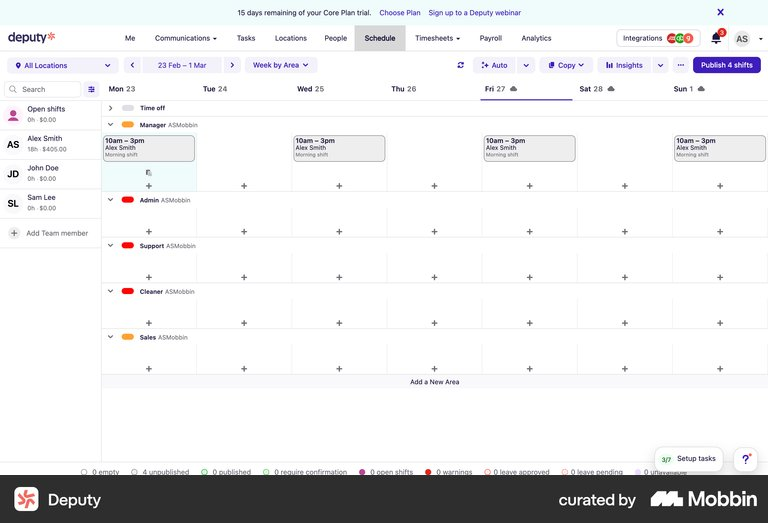
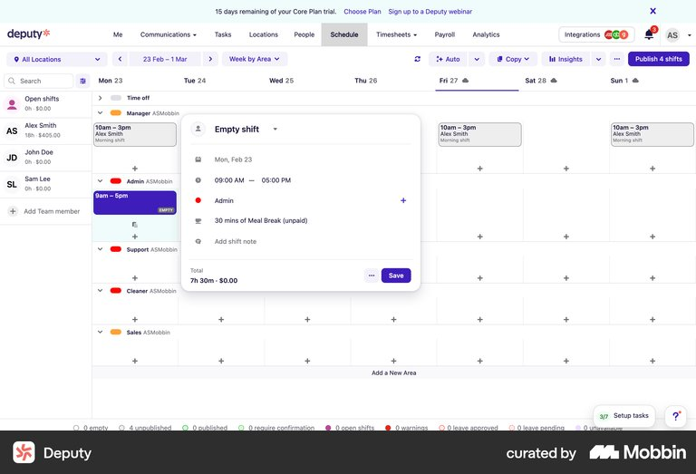
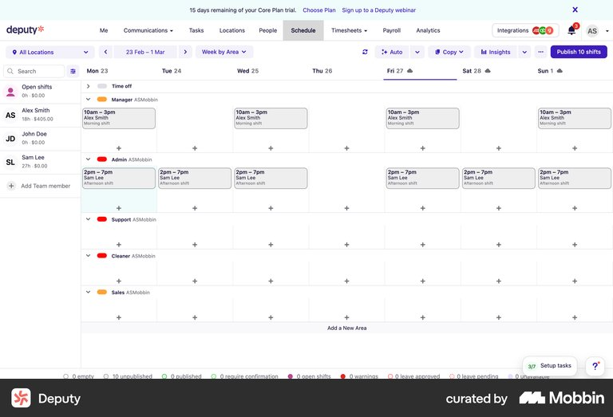
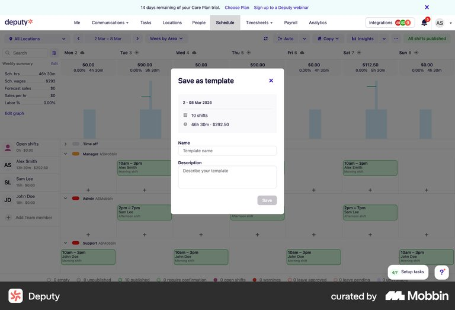

# Operational Responsibility Roster — Design Execution Plan

**Spanish name:** Matriz Maestra de Responsables Operativos  
**Status:** Proposed execution plan for the first prototype  
**Date:** 2026-07-25  
**Authority:** This plan follows `docs/product/product_definition.md`, `docs/product/ux_ui_decisions.md`, `docs/product/alert_catalog.md`, `docs/design/design.md`, the Monitor design tokens, and the accepted Dashboard V2 implementation in `apps/web/src/App.tsx`. It is not canonical product authority until the prototype is reviewed and the accepted decisions are consolidated into `docs/product/ux_ui_decisions.md`.

## 1. Objective

Design the smallest administration surface that can deterministically resolve the standardized routing positions in the alert catalog to actual people.

The first prototype must:

- use only the standardized positions already defined in the alert catalog;
- support the three existing worker groups `A`, `B`, and `C`;
- represent their repeating two-day / two-night / two-rest rotation as one reusable six-day cycle;
- allow workers to belong to a group without displaying every worker on the primary screens;
- preserve machine and work-order operator resolution through QR or ERP evidence;
- support workers who cover one shift, an entire operation, multiple operations, or the whole factory;
- represent vacation, sick leave, and temporary replacements as exceptions to the base assignment;
- remain compact and visually consistent with Dashboard V2; and
- avoid unnecessary scheduling, payroll, labor-clash, and role-authoring features.

## 2. Evidence from the attendance example

The supplied `Asistencia IMPRESIÓN JULIO 2026.xlsx` contains:

- 60 populated worker rows;
- one worker identifier and name per row;
- one column per date;
- recurring daily codes including `A3` and `C3`;
- `L` entries for leave or absence; and
- blank cells on non-working or otherwise unrecorded days.

The workbook confirms that a per-worker calendar grid is too large for the primary Monitor interface. It should be used as import evidence and exception input, not copied as the roster's permanent editing model.

The prototype must not assume the meaning of workbook codes. Import requires an explicit mapping step, for example:

- source code → day shift;
- source code → night shift;
- source code → rest;
- source code → vacation, sick leave, or another absence.

## 3. Fixed standardized positions

Monitor users cannot create, rename, or delete routing positions in the first version. The interface reads this fixed list from the alert catalog:

1. Factory manager.
2. Operation shift supervisor.
3. Technical leader.
4. OT machine operator.
5. Material planner.
6. Planner.
7. Raw-material warehouse dispatcher or sender.
8. Raw-material warehouse supervisor or leader.
9. Process-team operator.
10. Process-team supervisor.

The administration action is `Asignar responsable`, not `Nueva responsabilidad`.

Each alert continues to determine which standardized position is required. The roster only resolves that position to a person or group under the effective operational context.

## 4. Assignment scopes

The assignment editor supports four fixed scope types.

### 4.1 Work order or machine

- Used primarily by the OT machine operator.
- Actual operator is resolved from the QR scan or ERP actor attached to the work order.
- The administrator may configure machine or operation coverage and the evidence source.
- No shift field is required when the work-order evidence identifies the operator.
- These records are visibly identified as evidence-resolved and are not edited as ordinary manual person assignments.

### 4.2 Operation and active group

- Used by shift supervisors and other positions that rotate with groups `A`, `B`, and `C`.
- Stores operation, standardized position, and the responsible person or worker group.
- Current day/night/rest state comes from the group rotation.
- Attendance evidence may temporarily remove an absent worker or confirm active membership.

### 4.3 Entire operation

- Used by technical leaders and other positions responsible across all shifts.
- Stores operation, standardized position, person or group, and effective dates.
- Does not require a shift or rotating group.

### 4.4 Multiple operations or whole factory

- Used for positions such as factory manager, production planner, or another leader covering several operations.
- Stores selected operations or `Toda la fábrica`.
- Does not require a shift.

## 5. Group rotation model

There are only three base groups: `A`, `B`, and `C`.

All three use the same six-day repeating cycle:

1. Day shift for two days: 07:00–19:00.
2. Night shift for two days: 19:00–07:00.
3. Rest for two days.
4. Repeat indefinitely.

The groups use different offsets within the same cycle:

| Group | Days 1–2 | Days 3–4 | Days 5–6 |
|---|---|---|---|
| A | Day | Night | Rest |
| B | Night | Rest | Day |
| C | Rest | Day | Night |

The schedule engine is cycle-based, not week-based. A weekly weekday recurrence is insufficient because the six-day cycle moves across calendar weekdays. One week may therefore show five working days for a group, while another week may show a different distribution.

The rotation requires:

- one anchor date;
- the day, night, and rest durations;
- the offsets for groups `A`, `B`, and `C`;
- `Sin fecha final` as the default;
- an optional end date when a future pattern replaces it; and
- effective-date history when the pattern changes.

The first version does not need a template library because there is currently one shared rotation pattern.

## 6. Information architecture

The roster is one Monitor destination with two internal views:

1. `Responsables`
2. `Rotación`

These are compact 28px tabs inside the content area. There is no wizard.

### Screen count

- Two internal views.
- Four temporary editing surfaces.
- No separate warning, audit-log, template-library, payroll, or labor-clash screen.

The roster's final placement in application navigation remains a product decision. The prototype must not silently add a third bottom-navigation destination.

## 7. Dashboard V2 density contract

The prototype must reuse the shared MUI theme from `packages/design-system/src/index.ts` and the composition already used by `apps/web/src/App.tsx`.

| Element | Required treatment |
|---|---|
| Application header | 48px high, matching Dashboard V2 |
| Header title | `body2`, 12px, bold, centered |
| Header icon targets | 40×40px |
| Content maximum width | 1280px |
| Content horizontal padding | 8px mobile, 12px tablet, 16px large desktop |
| Content vertical padding | 8px mobile, approximately 10px tablet/desktop |
| Section title | `h2`, 14px, semibold |
| Routine labels and controls | 11px |
| Primary table data | 12px |
| Visible input, button, tab and chip height | 28px |
| Compact-control radius | 6px |
| Compact-control horizontal padding | 8px |
| Desktop interactive target | At least 40px |
| Mobile interactive target | At least 44px without enlarging the visible control |
| Primary desktop table row target | 48px, matching Dashboard incident rows |
| Table horizontal cell padding | 8px |
| Table vertical cell padding | Approximately 4px |
| Standard content gaps | 4px, 8px, 12px, or 16px token steps |
| Dialog and drawer content padding | 16px |
| Mobile bottom sheet | Maximum 88vh, 16px top radius, matching Dashboard V2 |

The earlier proposal of a 20px roster page title and an approximately 44px toolbar is rejected. The roster uses the existing 48px application header and 12px centered header title. Internal view titles use the 14px section-title role.

All labeled roster controls must preserve the shared compact floated/notched label position when empty, filled, focused, read-only, disabled, or in error. This applies to text inputs, selects, autocompletes, date fields, and text areas. Placeholders remain separate value hints and never replace or reposition labels.

## 8. View 1 — Responsables

### Purpose

Show every fixed routing position and how Monitor currently resolves it for each applicable context.

### Primary components

1. Existing Monitor application header:
   - centered title: `Matriz de responsables`;
   - existing ecosystem menu behavior;
   - no oversized secondary subtitle.

2. Internal view tabs:
   - `Responsables`;
   - `Rotación`.

3. Excel-style filtering and search inside each `Responsables` column header; no separate filter toolbar.

4. One outlined table:
   - sticky header;
   - fixed layout;
   - no horizontal scrolling;
   - complete row is selectable.

### Table columns

1. `Posición`
   - Fixed alert-catalog position.

2. `Cobertura`
   - Factory, operation, operation and group, machine, or work order.

3. `Resuelto por`
   - Person, group, QR evidence, attendance evidence, or fixed assignment.

4. `Vigencia`
   - Start date and optional end date.

5. `Estado`
   - Current, future, expired, absent, or temporarily replaced.

The first prototype does not include `Faltan responsables` or `Solapamientos` filter chips. Missing/conflicting assignment presentation remains required before Phase 5 implementation, but it is deferred from this first visual version.

### Row behavior

- Selecting a row opens the assignment drawer.
- Fixed positions cannot be created or deleted.
- An unassigned row uses `Asignar responsable`.
- An assigned row uses `Editar asignación`.
- Evidence-resolved OT operator rows show their source and are read-only where the person comes from QR or ERP evidence.

## 9. Group membership and exceptions

### Purpose

Manage group membership in `Responsables` and real-world availability in `Rotación`, without a separate `Grupos A/B/C` tab.

### Primary components

1. `Grupo` column and Excel-style group filter in `Responsables`.
2. Compact operation selector in `Rotación`.
3. Exactly three calendar rows:
   - Group A.
   - Group B.
   - Group C.

### Rotation group-row content

- Group name.
- Current phase: day, night, or rest.
- Next phase and change time.
- Member count.
- Count of current absences.
- Complete row opens the group drawer for availability and replacement detail.

Rows use the same 48px interactive height as Dashboard V2.

### Group drawer

The drawer contains:

- group name, which is fixed to A, B, or C;
- current and next rotation phase;
- searchable member list;
- worker name and operation or operations;
- current availability;
- effective group-membership dates;
- `Agregar trabajador`;
- `Registrar ausencia`;
- `Asignar reemplazo temporal`; and
- compact membership and exception history.

The member list may scroll inside the drawer. The primary calendar never expands all workers.

### Worker availability exceptions

Vacation and sick leave do not modify the six-day group pattern. They create effective-dated exceptions for one worker:

- worker;
- absence type;
- start date and time;
- end date and time;
- optional note;
- optional temporary replacement; and
- evidence source, including imported attendance when applicable.

When the period ends, the worker automatically returns to their existing group pattern.

## 10. View 2 — Rotación

### Authorization

- Only Monitor administrators can open `Responsables` or add, edit, activate, or deactivate people.
- `Rotación` includes an operation context. Its edit action is enabled only for a Monitor administrator or a person with the EmusaSoft-authenticated `roster:rotation:manage` permission for that operation.
- More than one person may hold the scheduling permission for the same operation.
- Permission assignment is not part of this interface. Monitor consumes and audits the EmusaSoft authorization result.

### Purpose

Make the relationship between groups A/B/C and day/night/rest immediately understandable.

### Primary components

1. Compact date navigation:
   - previous period;
   - today;
   - next period;
   - date-range label.

2. Operation filter when the viewer needs to inspect members from one operation.

3. `Editar patrón` secondary action.

4. Calendar grid:
   - three rows only: A, B, and C;
   - date columns;
   - day, night, and rest shown as written labels plus restrained color;
   - absence or replacement markers shown as a secondary indicator;
   - no worker-by-worker rows.

### Responsive date span

- Large desktop: 14 days.
- Tablet and small desktop: 7 days.
- Mobile: 3 days with previous/next navigation.

The grid reflows by date span and never produces document-level horizontal scrolling.

### Calendar cell content

Each cell contains only:

- `Día`, `Noche`, or `Descanso`;
- shift time when working; and
- a small exception count when workers are absent or replaced.

Selecting a cell opens the relevant group drawer focused on that date.

## 11. Temporary editing surfaces

### 11.1 Assignment drawer

Used to inspect or edit the assignment of an existing standardized position.

It conditionally shows only the fields required by the selected catalog position and assignment scope:

- standardized position, read-only;
- operation, machine, or factory scope;
- group or person;
- evidence source;
- effective start and end;
- temporary replacement;
- current routing result; and
- compact assignment history.

Desktop width is `min(480px, 100vw)`. Mobile uses a full-width or full-screen surface. This width is a layout constraint, not a new density token.

### 11.2 Group drawer

Used for group membership, absence, replacement, and group history. It is the only surface that lists individual workers.

### 11.3 Rotation-pattern dialog

Used rarely to establish or replace the shared A/B/C cycle.

Fields:

- anchor date;
- day shift start and end;
- day-shift duration in cycle days;
- night shift start and end;
- night-shift duration in cycle days;
- rest duration in cycle days;
- group offsets;
- no end date or explicit end date; and
- effective date for the new pattern.

The default visual summary reads:

`2 días · 07:00–19:00 → 2 noches · 19:00–07:00 → 2 días de descanso`

This is one compact dialog, not a wizard and not a drag-and-drop template builder.

### 11.4 Attendance import dialog

The secondary `Importar asistencia` action opens:

1. file selection;
2. column identification for worker ID, worker name, and dates;
3. explicit mapping of source codes to day, night, rest, vacation, sick leave, or ignore;
4. preview of affected workers and dates;
5. validation of unknown workers, unknown codes, and invalid dates; and
6. confirmation.

The import updates attendance evidence and exceptions. It does not silently rewrite the canonical A/B/C rotation.

## 12. Visual direction

### Intent

An authorized Monitor administrator needs to maintain deterministic routing without reading a large HR scheduling system. The experience should feel compact, calm, technical, and familiar.

### Hierarchy

- Focal point in `Responsables`: fixed position and current assignee.
- Focal point in `Rotación`: the three-row repeating cycle.
- Filters and secondary actions remain visually subordinate.

### Palette

- EMUSA navy for structure and primary text.
- Cyan for actions, selection, and focus.
- Green only for verified active or completed states.
- Orange for a written administrative exception or attention state.
- Red only for an actual invalid or unresolved condition.
- Calendar pattern colors remain restrained and always include `Día`, `Noche`, or `Descanso` text.

### Depth

- Flat, outlined sections matching Dashboard V2.
- Dividers and alignment before additional containers.
- Dialog shadow only for temporary surfaces.
- No nested decorative cards.

### Typography and spacing

- Montserrat only.
- Tokenized 11px, 12px, and 14px operational hierarchy.
- 4px spacing rhythm.
- No private control-height, padding, radius, or table-density scale.

## 13. Atlas research evidence

**Atlas instance:** `atlases/instances/operational-responsibility-roster/`  
**Durable review source:** `review-state.json`  
**Research rounds:** Round 1 covered assignments, coverage, conflicts, and audit. Round 2 narrowed the research to assignment scope, recurring worker groups, rotation, and scheduling evidence.

The screenshots below are research references, not implementation specifications. The written Atlas comments are authoritative. Some transparent region labels in the Deputy flow were placed on the wrong screen, especially the recurrence and worker-selection regions. Those comments remain valid requirements, but their overlay coordinates must not be copied.

### 13.1 Patterns to adopt

| Pattern | Decision for the roster |
|---|---|
| Familiar calendar view | Use a compact date grid because it is recognizable and requires little training. |
| Three summarized worker groups | Show groups A, B, and C as the primary rows. Do not show every worker in the main calendar. |
| Compact date navigation | Keep previous, today, next, range, and view controls in one short toolbar. Remove payroll and unrelated controls. |
| Small shift editor | Use a compact temporary surface for group, date/time, shift type, and effective dates. |
| Indefinite recurrence | Configure one six-day cycle with an anchor date and default `Sin fecha final`; do not rebuild schedules week by week. |
| Saved recurring result | Show the resulting pattern directly in the calendar with group labels and restrained phase colors. |
| Reusable pattern | Preserve the ability to save or replace the common A/B/C rotation, but do not build a general template library in the first version. |
| Spreadsheet import | Allow HR attendance or rotation evidence to be uploaded with explicit code mapping and validation. |

### 13.2 Reference images

#### Compact calendar and date navigation

Useful for the three-row `Rotación` view: short controls, familiar dates, visible schedule context, and a left rail that can be reduced to groups A, B, and C.

#### Compact shift editor

Useful for the rotation-pattern or assignment surface. Keep the temporary editor small and show only fields required by the selected assignment scope. The roster replaces individual employees and payroll fields with worker group, operation, phase, effective dates, and recurrence.

#### Recurring schedule result

Useful for showing that a saved group pattern has propagated across dates. The roster must make the result denser and reduce the primary rows to A, B, and C.

#### Saving a reusable pattern

Useful only as evidence that a schedule can be named and reused. The roster must not reproduce the surrounding analytics, payroll data, or full scheduling application.

### 13.3 Reference-level feedback

#### 7shifts — Assigning an existing employee

- Review status: accepted for detailed component analysis, not approved as the roster structure.
- Comment: “I don't like that this is assuming that all workers have shifts. It is a good design though. I will keep it for detailed review.”
- Implication: reuse compact assignment interaction patterns, but support evidence-resolved machine/work-order operators and operation-wide leaders who do not have a roster shift.

#### Square — Publishing a shift schedule

- Review status: accepted.
- Comment: “I like the calendar view but not the fact that I have to choose every shift and create this for every week. In the case I'm creating this is something that will keep on going forever. I also like the ‘Add shift’ modal.”
- Implication: use the calendar and compact editor, but generate the schedule from an indefinite six-day pattern.

#### Employment Hero — Clashes

- Review status: rejected.
- Comment: “Not interested in seeing clashes. It doesn't apply to our specific functionality.”
- Implication: do not add a labor-clash screen or first-version clash filters.

#### 7shifts — Assignment matrix

- Review status: not selected for component analysis.
- Comment: “This is a good example of a way to relate people to operations and to roles. Not exactly to machines or work orders.”
- Implication: retain the relationship concept, but use fixed alert-catalog positions and the four roster scope types rather than a generic role matrix.

#### Zoho CRM — Audit log

- Review status: rejected.
- Comment: “Not what I'm looking for at all.”
- Implication: no separate audit-log screen in the first prototype. Show compact effective-date history only inside the relevant drawer.

#### 7shifts — Moving an employee to a role

- Review status: rejected as a primary list.
- Comment: “I have too many workers in the plant. This design would be extremely long. This is not the way I would like to manage it. I would like to have groups of workers sharing a shift and groups of workers sharing an operation. I could add these groups to a table designed like this. But not each worker.”
- Implication: the main screen contains three group rows. Individual workers appear only in a searchable group drawer.

#### Deputy — Adding custom shifts

- Review status: accepted.
- Comment: “This left side bar with worker names could also have worker groups. I like that. I could also plan weeks ahead in a simple to use calendar view. I also like the modal to add specific shift data and the repeat pattern functionality.”
- Implication: use group rows, compact calendar navigation, a small editor, and visible recurrence.

#### Deputy — Saving a schedule template

- Review status: accepted for the pattern concept.
- Comment: “This looks very interesting from the point of view I can build patterns, assign them to a large group and the way to schedule those templates. I don't really understand how this works so I would like some clarification to see how I can better use it. One thing I don't like is that there's too much information in the screen and it doesn't look easy to use. I would like a simpler solution.”
- Implication: provide one clear shared rotation-pattern dialog, not a general template-management application.

#### 7shifts — Locations, departments, and roles

- Review status: rejected.
- Comment: “I don't really understand what this is or how this solves the problem I'm trying to solve. You should suggest things that solve the specific problem stated in the docs.”
- Implication: do not expose generic location/department administration. Use the operations, machines, work orders, and positions already defined by Monitor.

### 13.4 Detailed component comments

#### 7shifts — Assigning an existing employee

- Date and department filters: “Use this to set up supervisors to their shifts.”
- Role assignment grid: “This grid looks too cumbersome. It could be simpler.”
- Assignment fields: “Not what I'm looking for.”
- Assignment history entry: “Doesn't apply to the problem I'm trying to solve.”
- Custom region — Excel import: “This is super useful in case HR wants to upload their shift rotation in Excel.”

Design consequence: keep supervisor-to-active-group assignment, eliminate the generic per-worker role grid, and provide import as a secondary action.

#### Square — Publishing a shift schedule

- Final schedule: “This final schedule looks simple and I like that, but it's not as compact as I like. There are many more workers and I would need more rows, so shorter rows are preferable to me.”
- Schedule navigation: “This is a good schedule navigation but I'd rather have something like the custom schedule from Google Calendar that I'm attaching as a picture. It allows assigning to a group of people that always move together since they are in the same shift, a single custom shift that will repeat for some time into the future.”
- Empty state: “This is good.”
- Add team members: “Good.”
- Schedule controls: “I like that these are compact.”
- Schedule content: “The calendar view is something known to users. Easy to learn and use.”
- Shift assignee: “This is something good. So I can create a pattern and make it repeat so I don't have to write it all over. The colors are a nice addition though not strictly necessary.”
- Shift date and time fields: “Yes. This is what I'm looking for.”
- Published grid: “This looks good. Could it be made more compact? Like a summary of groups of people?”
- Update grid: “Not necessary.”

Design consequence: retain the recognizable calendar, empty state, compact navigation, editor, and restrained phase colors; summarize groups rather than workers; remove weekly manual setup and the update grid.

#### Deputy — Adding custom shifts

- Date navigation: “This is a great navigation. Looks compact. Has all the options we may need. Payroll is not one of the options I need. Let's analyze these options in the light of the problem we're trying to solve.”
- Schedule overview: “Good compact view with color coding to see in one view. Also like the copy option and the date navigation. I'd rather have fewer headers though.”
- Shift form: “This is exactly what's needed. A possibility to assign worker groups to dates. What's missing is a way to make it repeat and have custom repeated schedules, like what Google Calendar allows.”
- Recurrence: the Atlas overlay is misplaced, but the required behavior is a repeat interval, selected cycle days, and an end condition.
- Worker selection: the Atlas overlay is misplaced, but worker or group selection is required.
- Group label: “Like. Include in the design.”
- Recurring result: “Like. Build something like this.”

Design consequence: use one compact calendar toolbar, one small group/shift editor, a visible recurrence summary, and a three-row recurring result. Do not copy the Atlas coordinates for recurrence or worker selection.

#### Deputy — Saving a schedule template

- Template list: “I like that I can save templates. Though I don't understand this screen. Include the feature but make the screen much simpler than this one. There's too much information and it is too hard to learn to use.”
- Template builder: “This looks good but the commands should be more like Google Calendar's.”

Design consequence: in the first version, represent the one shared A/B/C cycle as an editable saved pattern. If more patterns are needed later, add a simple template list as a separate iteration.

### 13.5 Research synthesis

The Atlas evidence supports this first-version composition:

1. `Responsables` remains a compact fixed-position table derived from the alert catalog.
2. Group membership is maintained in `Responsables`; availability and temporary replacement details open from `Rotación`.
3. `Rotación` is a familiar calendar with three group rows, compact date controls, and an indefinitely repeating six-day cycle.
4. Assignment and rotation editing use small drawers or dialogs rather than permanent forms.
5. Attendance spreadsheet import is secondary and explicitly mapped; it supplies availability evidence and exceptions.
6. Payroll, clashes, generic role creation, generic location administration, large employee matrices, and standalone audit views are excluded.

## 14. Explicit exclusions from the first prototype

- Creating, renaming, or deleting standardized routing positions.
- `Faltan responsables` and `Solapamientos` quick-filter chips.
- Payroll.
- Labor-schedule clash detection.
- One permanent calendar row per worker.
- Rebuilding the schedule one week at a time.
- Weekly-only recurrence.
- A schedule-template library.
- Drag-and-drop scheduling.
- A separate audit-log screen.
- A separate warning-management screen.
- A multi-step wizard.
- A permanent sidebar.
- KPI cards or summary banners.

## 15. Prototype implementation order

### Step 1 — Shared shell and density

- Reuse `monitorTheme`.
- Reproduce the accepted 48px header, content container, compact controls, table typography, and responsive padding from Dashboard V2.
- Add the two internal tabs without deciding final product navigation.

### Step 2 — Fixed positions and assignments

- Seed the ten alert-catalog positions.
- Build the `Responsables` table.
- Build the conditional assignment drawer.
- Demonstrate all four assignment scopes.

### Step 3 — Groups A/B/C

- Build the three-row group view.
- Add representative members from several operations.
- Build searchable membership inside the group drawer.
- Add vacation, sick leave, and temporary replacement examples.

### Step 4 — Six-day rotation

- Build the shared 2-day / 2-night / 2-rest cycle.
- Apply offsets to A, B, and C.
- Build the 14-, 7-, and 3-day responsive calendar variants.
- Build the rotation-pattern dialog.

### Step 5 — Attendance import

- Build the import and code-mapping dialog using the supplied workbook structure as the reference.
- Demonstrate that imported leave becomes a worker exception and does not rewrite the base rotation.

### Step 6 — Required states

- Loading.
- Empty member list.
- Unknown imported worker.
- Unknown attendance code.
- Active vacation.
- Active sick leave.
- Temporary replacement.
- Expired assignment.
- Read-only QR/ERP-resolved OT operator.

### Step 7 — Verification

- Verify desktop, tablet, and mobile without horizontal page overflow.
- Verify computed control and typography measurements against Monitor tokens.
- Verify keyboard focus, drawer/dialog focus management, 40px desktop targets, and 44px mobile targets.
- Verify every labeled control in empty, filled, focused, read-only, disabled, and error states; labels must not shift, overlap borders, or fall into the value line.
- Verify that every role displayed exists in the alert-catalog glossary.
- Verify that no UI allows creation of a new standardized position.
- Verify that the A/B/C pattern repeats every six days rather than resetting by calendar week.

## 16. First prototype acceptance criteria

The first version is ready for user review when:

- the ten fixed alert-catalog positions are visible and assignable;
- the application header and density match Dashboard V2;
- there are exactly three worker groups, A, B, and C;
- the three groups visibly share one offset six-day rotation;
- a 60-worker scenario does not expand the primary views into 60 rows;
- an administrator can inspect and change group membership;
- vacation and sick leave appear as effective-dated worker exceptions;
- a temporary replacement can cover an unavailable person;
- the calendar is understandable without training;
- the attendance import requires explicit code mapping;
- no weekly schedule must be rebuilt manually;
- no role-authoring, payroll, clash-management, or template-library UI appears; and
- desktop and mobile remain compact and free of horizontal page scrolling.
