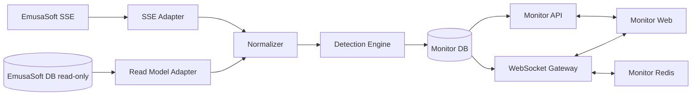

# Monitor: EmusaSoft Integration Architecture and Production Roadmap

> **Scope:** This document governs architecture and technical sequencing within the product defined in `docs/product_definition.md`. Technical phases are not product releases and do not redefine the four main screens.

**System:** Monitor — Dashboard, Chats, Errors, and Alerts

**Version:** 1.0

**Status:** architecture approved to begin Phase 0

**Analysis date:** 2026-07-19

**Primary sources:** EmusaSoft MCP catalog, production MySQL schema extracted on 2026-07-16, workspace documentation and prototypes, and EmusaSoft architect answers dated 2026-07-19
**Not included:** application scaffold, application code, executable migrations, or EmusaSoft changes

## 1. Architecture decision summary

Monitor must be built as a separate application and service integrated with EmusaSoft, not as logic embedded directly in the ERP production database.

The confirmed target architecture is:

1. Monitor is a new system with its own repository, deployment, and control database.
2. The EmusaSoft database is an external, read-only operational source. Monitor never writes to it.
3. Monitor consumes the EmusaSoft SSE stream directly. EmusaSoft uses Redis for its real-time infrastructure.
4. The SSE event contract is derived from Monitor's functional requirements and versioned between both systems.
5. An SSE adapter normalizes EmusaSoft events; a read-only SQL adapter reconciles data, adds context, and recovers gaps.
6. An idempotent detection engine transforms EmusaSoft evidence into Monitor incidents.
7. Monitor's database stores rules, normalized events, cursors, incidents, evidence, conversations, messages, receipts, deliveries, and audit history.
8. Monitor uses WebSockets for bidirectional client communication, including messages, read receipts, presence, typing, and dashboard updates.
9. Monitor's Redis coordinates fan-out, presence, and horizontal WebSocket scaling. The database—not Redis—is the source of truth for messages and incidents.
10. A Monitor API serves queries, history recovery, and persistent commands. WebSockets distribute committed changes and ephemeral signals.
11. Operational records are corrected in EmusaSoft. Monitor keeps deep links and later observes the correction.
12. Monitor provides a read-only view of every `CLOSED_WITHOUT_RESOLUTION` incident, including evidence, reason, administrator, and operational references.
13. Inventory, valued-kardex, and accounting adjustments are outside Monitor. Monitor never schedules, requests, tracks, or applies adjustments and never receives EmusaSoft write credentials.

### Technical strategy

**Diagnosis:** EmusaSoft already owns the operational record and emits real-time changes through SSE and Redis. Monitor is an independent communication and control system. The missing layer must consume events reliably, reconcile them against read-only data, detect divergence, preserve evidence, and support bidirectional conversations. The primary architectural risks are confusing inbound SSE with client WebSockets, treating Redis as persistence, or interpreting database timestamps as physical events.

**Guiding policies:** one source of truth per domain; writes only to Monitor's database; read-only access to EmusaSoft; no adjustment integration; SSE for EmusaSoft input; WebSockets for client interaction; persist before publishing; reconcile every stream; keep detectors and commands idempotent, versioned, and explainable; deliver deterministic rules first.

**Actions:** formalize SSE, read-only SQL, and WebSocket contracts; create the Monitor repository and database; build recoverable ingestion and reconciliation; deliver a vertical slice using A02, A03, and A05; enable bidirectional conversations; add the unresolved-closure view; then add balance and statistical models. The minimum proposed kit is TypeScript, a Monitor API, a relational database, Redis, and WebSockets. Concrete libraries must be selected through ADRs before scaffolding.

## 2. Confidence levels

- **Confirmed:** directly visible in the SQL dump, MCP catalog, approved documentation, or architect answers.
- **Inferred:** a reasonable technical conclusion based on direct evidence without access to the implementing source file.
- **Pending:** cannot be confirmed from the available sources.

The MCP does not expose repository files, dependencies, modules, controllers, resolvers, or deployment infrastructure. It exposes a generated GraphQL catalog, entities, SQL tables, examples, and the UI system. Architect answers add five decisions: EmusaSoft uses SSE and Redis; Monitor consumes SSE directly; the contract follows functional requirements; Monitor owns its repository and database; and EmusaSoft database access is read-only. Endpoint, authentication, payload, delivery guarantee, and topology details remain Phase 0 contracts and do not change the target architecture.

**Current precedence:** the product decision dated 2026-07-19 removes the adjustment queue and every regularization API. Detection rules and evidence remain governed by the active alert catalog; unresolved closures remain a read-only Monitor view.

## 3. Sources inspected

### 3.1 EmusaSoft MCP

Catalog version 2, generated on 2026-07-13T08:16:37Z:

- 1,034 GraphQL operations;
- 345 entities;
- 345 cataloged SQL tables; and
- 1,034 examples.

MCP surfaces used:

- `erp_get_catalog_info`
- `erp_search`
- `erp_describe`
- `erp_get_example`
- `erp_validate_graphql`
- `erp_run_graphql`

The 2026-07-19 verification successfully executed an authenticated read-only `getUserContext` query. Catalog-backed validation returned `schema unavailable`; restoring the validator and regenerating the drifted catalog are assigned to the MCP implementation team in `docs/emusasoft_preimplementation_requests.md`.

Representative operations inspected:

- identity and permissions: `getUserContext`, `getSysUserById`, `getUsers`, `getRolesByUser`, `getPermissionsByUserOrGroup`;
- document participation: `getAvailableDocumentUsers`, `getDocumentResponsibleUsers`, `notifyUsersInDocument`;
- comments and reads: `getSysCommentUsersByCommentId`, `createSysCommentUser`, `addSysReadUser`;
- presence: `pingActiveUser`, `updateStateUser`;
- production: `getWorkOrder`, `getWorkOrderClosureById`, `getWorkOrdersWithActiveFinalProcess`, `getWorkProduction`;
- materials: `getWorkOrderMaterialStocksById`, `getWorkOrderMaterialStockContainersConsumed`.

Representative entities inspected:

- `Document`, `SysUser`, `WorkProduction`, `WorkOrder`;
- `WorkOrderMaterialStock`, `WorkOrderMaterialStockContainer`;
- `MaterialFlow`, `MaterialFlowDetail`, `ArticleSerial`, `ScaleLoad`;
- `Warehouse`, `Equipment`, `ProductionSerial`.

### 3.2 Extracted database

File: `local-data/database/prod_emusa_core-20260716-143040.sql`

- MySQL 8.0.45 dump from a MySQL 8.0.43 production server;
- database: `prod_emusa_core`;
- source: production RDS MySQL in `us-east-1`;
- predominant charset and collation: `utf8mb4` and `utf8mb4_unicode_ci`;
- 363 `CREATE TABLE` statements;
- 361 primary keys, 179 unique indexes, 718 secondary indexes, and 803 foreign-key constraints;
- no observed `CREATE VIEW`, `CREATE TRIGGER`, `CREATE PROCEDURE`, `CREATE FUNCTION`, or `CREATE EVENT` definitions;
- tables without formal primary keys: `centro_costo_usuario` and `documento_relaciones`, both with composite indexes.

The dump contains 18 more tables than the MCP catalog. The most likely cause is drift between the catalog generated on 2026-07-13 and the dump produced on 2026-07-16. Regenerate the catalog or validate each operation against the current schema before building adapters.

### 3.3 Workspace documentation and UX/UI

Active sources:

- `docs/product_definition.md`
- `docs/alert_catalog.md`
- `docs/ux_ui_decisions.md`
- `docs/design/design.md`
- `docs/design/brand_guidelines.md`
- `docs/design/design-system/tokens.json`
- `docs/emusasoft_preimplementation_requests.md`
- `prototype/alert-catalog/final/index.html`
- `prototype/chat-list-review/chat-list-final.html`
- `prototype/chat-list-review/chat-detail.html`
- `prototype/chat-list-review/dashboard.html`

Deprecated historical sources:

- `docs/archive/project_context.md`
- `docs/archive/dashboard_rationale.md`
- `docs/archive/discovery.md`
- `prototype/dashboard/`
- `prototype/alert-catalog/v1/` through `v10/`

## 4. Observable EmusaSoft architecture

### 4.1 Confirmed layers

| Layer | Evidence | Conclusion |
|---|---|---|
| Web client | ERP routes, Emusa UI Storybook, and existing prototypes | EmusaSoft is a modular web application. |
| API contract | 1,034 GraphQL operations and generated examples | GraphQL is the main observable ERP interface. |
| Domain model | 345 GraphQL entities | The API exposes broad relational entities, not only flat DTOs. |
| Persistence | MySQL 8 dump with 363 tables | MySQL is the observed primary system of record. |
| ORM and migrations | `_prisma_migrations` | Prisma manages at least part of the schema. |
| Authorization | `sys_*` tables, resources, groups, roles, permissions, and matrices | Access combines RBAC, grouping, and resource-level control. |
| Documents and workflows | `documentos`, types, states, stages, assignees, and logs | A cross-cutting document and workflow core exists. |
| Outbound communication | `mensaje_flujos`, `mensaje_plantillas`, `notifyUsersInDocument` | EmusaSoft has template-based multichannel notification capabilities. |
| Comments and reads | `sys_comentarios`, `sys_comentario_usuarios`, `sys_lecturas`, `sys_lectura_usuarios` | Reusable comment and read-receipt primitives exist. |
| Presence | `SysUser.state`, `pingActiveUser`, `updateStateUser` | The API models available, paused, and disconnected users. |

### 4.2 Not confirmed

- exact backend framework or repository topology;
- actual service boundaries;
- exact Redis topology and channel ownership;
- SSE ordering, duplicates, retention, replay, and backpressure guarantees;
- identity provider and login protocol;
- deployment, container, ingress, load-balancer, and autoscaling topology;
- caches, queues, jobs, and scheduler;
- observability providers;
- concrete EmusaSoft SSE endpoint, authentication, and payloads; and
- Monitor WebSocket gateway technology.

No GraphQL `subscription` operation or catalog result for `websocket`, `socket`, `realtime`, or `subscription` was found. The architect confirmed that EmusaSoft real-time transport is SSE backed by Redis; Monitor must not assume an EmusaSoft bidirectional socket.

## 5. Cross-cutting document core

EmusaSoft is organized around a generic document and related module entities.

### 5.1 `documentos`

The table stores type, state, code, plant, company/contact, creator/updater/deleter/finalizer, lifecycle timestamps, deletion and read-only flags, root-document status, authorization resource, read container, attachments, comments, observations, parent/owner/inherited/generated relationships, previous state, and destination document type.

Confirmed GraphQL relationships include `Document.workOrder`, `Document.scaleLoad`, `Document.inventoryAdjustment`, `Document.requestWaste`, `Document.dispatchOrder`, and trigger-document relationships to material-flow details, plus commercial, purchasing, prepress, and dispatch surfaces.

### 5.2 Types, states, and stages

`documento_tipos.codigo` includes `MATERIALS_FLOW`, `WORK_ORDER`, `SCALE_LOAD`, `INVENTORY_ADJUSTMENTS`, `REQUEST_WASTE`, `DISPATCH_ORDER`, and `DISPATCH_DELIVERY_NOTE`. Each type can be associated with a workflow type, document role, icon, color, resource configuration, and attachment configuration.

`documento_estados` defines ordering, lock behavior, terminal behavior, defaults, and endpoints. `documento_estados_logs` stores state intervals and actors. `documento_detalles` stores stages, article references, estimated wait times, and separate creation and stage-change timestamps. `documento_logs` records assignee, state, activity, and information changes with old/new values, comments, actors, dates, and optional attachments.

### 5.3 Participation, responsibility, and visibility

- `documento_usuarios`: requester or commercial executive;
- `documento_responsable`: `DEFAULT`, `OPERATOR`, or `SUPERVISOR` assignee;
- `documento_responsable_tipo_config`: allowed instances per type;
- `sys_visibilidad_matriz_tipodocumento_rol`: visibility by type, role, and state;
- `sys_visibilidad_matriz_estadodocumento_etapa`: visibility and ordering by stage, type, transaction, state, role, and user type;
- `sys_matriz_flujotrabajotipos_rolparticipante`: workflow participation by workflow type and role.

### 5.4 Monitor implications

Monitor must retain external references to `documentId`, `workOrderId`, `articleSerialId`, `materialFlowDetailId`, `scaleLoadId`, `warehouseId`, `equipmentId`, `factoryId`, and `sysUserId`. It must not copy complete ERP documents except for minimum immutable evidence snapshots needed for audit.

A Monitor alert must not automatically become a new EmusaSoft `documentos` record. Doing so would require a new ERP document type, states, matrices, permissions, and GraphQL contracts. Monitor owns incidents and links them to existing ERP documents.

## 6. Identity, roles, and authorization

### 6.1 Users and presence

`sys_usuarios` and `SysUser` provide the internal numeric identity, external `userAccountId`, name, email, phone, internal/external status, enabled/disabled and soft-delete status, presence state (`DISPONIBLE`, `EN_PAUSA`, or `DESCONECTADO`), and relationships to plants, groups, roles, resources, documents, comments, and reads.

`getUserContext` returns identity, role, `roleSlug`, `sysUserId`, additional data, `sysUser`, and `requiredPingActive`. `pingActiveUser` and `updateStateUser` confirm application-level presence.

### 6.2 Permission model

| Table | Function |
|---|---|
| `sys_grupos` | Global group tree for masters, modules, reports, permissions, roles, and utilities. |
| `sys_grupo_usuarios` | User-group membership. |
| `sys_roles` | Roles with stable codes and grouping capability. |
| `sys_role_asignamientos` | Assigns a role to a user, group, or both. |
| `sys_permisos` | `ADMIN`, `GRANT`, `ACCESO_TOTAL`, `EDITAR`, and `VER` permissions. |
| `sys_role_permisos` | Includes or excludes permissions by role. |
| `sys_recursos` | Company, document, group, or warehouse resources. |
| `sys_recurso_compartidos` | Shares view, edit, or full access with groups or users. |
| `sys_control_accesos` | JSON permissions by resource and user. |
| `planta_usuarios` | Assigns or limits users to plants. |

Relevant operations include `getRolesByUser`, `getPermissionsByUserOrGroup`, `getAvailableDocumentUsers`, and `getDocumentResponsibleUsers`.

### 6.3 Monitor authorization policy

1. Each authenticated Monitor user maps to an EmusaSoft `sysUserId`.
2. Authentication—SSO, token exchange, or another supported approach—is selected by ADR before scaffolding. Monitor should not create passwords when supported corporate integration exists.
3. The Monitor backend resolves and verifies `sysUserId` for every session.
4. Authorization is calculated server-side; the browser never decides access.
5. The user must belong to an authorized plant.
6. Incident visibility derives from plant, operation, machine, warehouse, group, role, and explicit participation.
7. The plant manager sees every incident in the plant.
8. Supervisors and technical leaders see operations under their responsibility.
9. Operators and process personnel see conversations or incidents in which the roster resolves them as participants.
10. A person reached through multiple paths is deduplicated by `sysUserId`.
11. Example names in the alert catalog are never hard-coded recipients.

The influence-zone concept in the alert catalog is not an explicit table or operation in the current MCP catalog. Before production, confirm whether it is represented through groups, warehouse resources, external configuration, or uncataloged code.

## 7. Messages, comments, reads, and notifications

### 7.1 Existing outbound communication

`mensaje_flujos` defines notification flows with event name, channel (`EMAIL`, `WHATSAPP`, or `SMS`), and target origins including `DOCUMENT`, `WORK_ORDER`, `ARTICLE_SERIAL`, `REQUEST_WASTE`, and `WORK_PRODUCTION`.

Relevant flows include `NOTIFY_DOCUMENT_TRUNCATE`, `WORK_ORDER_TRUNCATED`, `MACHINE_PAUSED_LACK_OF_SUPPLIES`, `PRODUCTION_PLAN_CHANGED_LACK_OF_SUPPLIES`, `WORK_ORDER_CONSUMPTION_DIFFERENCE`, `WORK_ORDER_CONSUMPTION_ADJUSTMENT_REQUIRED`, `WORK_ORDER_CONSUMPTION_ADJUSTED`, `ARTICLE_SERIAL_OBSERVED`, `LAMINATING_PENDING_BALANCE`, `WORK_PRODUCTION_APPROVAL_REQUEST`, and `WORK_PRODUCTION_REJECTED`.

`mensaje_plantillas` connects a flow to a template and custom input JSON. `notifyUsersInDocument(documentId, userReceivedId, event)` confirms that EmusaSoft can notify document-linked users, but its implementation and delivery guarantees are not visible.

### 7.2 Existing comments and reads

`sys_comentarios` is a container of type `COMENTARIO` or `OBSERVACION`. `sys_comentario_usuarios` stores comment container, user, up to 500 characters of text, optional file, soft-delete status, actors, and lifecycle timestamps. Relevant operations include `getSysCommentUsersByCommentId`, `createSysCommentUser`, `editSysCommentUser`, and `deleteSysCommentUser`.

`sys_lecturas` is a read container; `sys_lectura_usuarios` connects reads to users and audit data. `addSysReadUser` records a read.

### 7.3 Reuse boundary

These primitives support document comments but do not explicitly cover Monitor conversations by machine/operation/shift/person, multiple incidents per conversation, replies, reactions, pins, stars, forwarding, private messages, edit/delete history, per-recipient delivery/read status, secure attachment metadata, or versioned system-message templates.

Forcing those capabilities into `sys_comentarios` would create coupling and ambiguous semantics. Monitor needs its own conversation model while retaining `sysUserId` and ERP references.

### 7.4 Recommended conversation model

| Entity | Essential fields |
|---|---|
| `monitor_conversation` | id, type, factory_id, operation_id, equipment_id, warehouse_id, shift_key, direct_pair_key, title, status, created_at, archived_at |
| `monitor_conversation_participant` | conversation_id, sys_user_id, role, joined_at, left_at, muted_until, notification_level |
| `monitor_message` | id, conversation_id, sender_sys_user_id, type, body, reply_to_id, forwarded_from_id, incident_id, client_message_id, created_at, edited_at, deleted_at |
| `monitor_message_attachment` | message_id, storage_key, filename, mime_type, size, checksum, scan_status |
| `monitor_message_receipt` | message_id, sys_user_id, delivered_at, read_at |
| `monitor_message_reaction` | message_id, sys_user_id, reaction, created_at |
| `monitor_message_pin` | message_id, conversation_id, pinned_by, pinned_at |
| `monitor_user_star` | message_id, sys_user_id, created_at |

Rules:

- `client_message_id` is unique per sender to prevent reconnection duplicates.
- System messages are created only from backend-signed incident events.
- Normal deletion is soft deletion; audit retains actor and timestamp.
- A message never changes an ERP condition or resolves an incident.
- Receipts are per user, not a global counter.
- Use an explicit many-to-many table when a conversation can group multiple incidents.

## 8. Relevant operational model

### 8.1 Plant, operation, machine, warehouse, and location

- `plantas`: top-level organizational entity;
- `planta_usuarios`: authorized users by plant;
- `operaciones`: operation codes, precedence, successors, result unit, minimum duration, tolerances, waste limit, and ordering;
- `equipos`: machine, code, organizational capacity, speed, dimensions, and status;
- `operacion_equipos`: many-to-many operation-equipment relationship;
- `almacenes`: warehouse by plant, type, reception, associated equipment, and authorization resource;
- `ubicaciones`: warehouse location, `INPUT`, `OUTPUT`, or `STORAGE` role, capacity, and extrusion container.

A warehouse can reference equipment through `almacenes.id_equipo`. This confirmed join resolves machine to warehouse, but does not prove influence zone or active shift.

### 8.2 Production and work orders

`ordenes_produccion` / `WorkProduction` stores code, state, type, planning and execution, plant, planned quantity/meters, production result, structure, comments, attachments, reviews, logs, parent-child relationships, and work orders.

`ordenes_trabajo` / `WorkOrder` connects production, operation, equipment, and document; sequence and code; planned and execution dates; closure dates; planned quantities, meters, and thousands; planned and consumed materials; reel tolerances; truncation, pause, closure, and closing user; neighboring orders; and materials, flows, outputs, serials, stocks, logs, and pre-reservations.

`getWorkOrder(workOrderId)` returns a broad aggregation and is the best confirmed starting point for a work-order snapshot. It does not replace incremental queries or events.

### 8.3 Reservations, stock, and consumption

- `pre_reserva_orden_trabajo`: source/destination work orders, material, stock, article, and `PENDIENTE` or `COMPLETADO` state;
- `orden_trabajo_material_stock`: planned/pending demand by work order, article, unit, structure, and type;
- `orden_trabajo_material_stock_contenedores`: container, location, current inventory, real/ideal closure, empty status, date, and user;
- `orden_trabajo_materiales`: work-order article/serial/batch, planned/distributed/unplanned type, incoming/returned/consumed quantities, meters, thousands, reservation, closure, and consumption origin.

Consumption can be traced to serial, location, stock, container, pre-reservation, and creator. For time-based alerts, verify whether `fecha_creacion` represents the operational event or only persistence.

### 8.4 Material flow

`flujo_materiales` owns a unique document and parent/root hierarchy. `flujo_materiales_detalles` stores article, serial, batch, initial/in-transit/received quantities, usage and inventory units, origin/destination warehouses and locations, work order/material, `TRANSITO`, `RECIBIDO`, `RECHAZADO`, or `ANULADO` state, receiver and receipt time, trigger documents, hierarchy, timestamps, and audit users. It is the primary source for A02 and part of A01/A05.

### 8.5 Declared production, serials, and weighing

`orden_trabajo_salidas` stores planned/result output, meters, type, grammage, width, reservations, and observed/weighed/unweighed package counters. `orden_trabajo_salida_detalles` identifies output, article, quantity, weighed/observed/partial status, and actor.

`articulo_serial` is the reel/material traceability record: unique serial code, initial/available quantity, warehouse/location, status including `CONFIRMAR_PESO`, type (`PRODUCTO_EN_PROCESO`, `ARTICULO`, `MERMA`, `SALDO`, or `SOBRANTE`), current/source work orders, output, target operation, parent serial, last closure, dimensions, scan/user, deletion, and audit.

`balanza_cargas` has a one-to-one document relationship and stores weighing mode, tare/gross/net weights, warehouse, and location. `balanza_carga_detalle_registros` uniquely references `articulo_serial` and stores net/tare/gross weight, `BOX` or `REEL` type, output, and audit.

### 8.6 Pauses, closure, and plausibility

- `equipo_pausa`: equipment, user, state, manual/automatic pause, start, resume, and source work order;
- `orden_trabajo_etapa_logs`: stage changes caused by closure or pause;
- `ordenes_produccion_logs`: state or information changes;
- `documento_logs` and `documento_estados_logs`: cross-cutting history;
- `equipos.velocidad_maquina`: machine-speed baseline for C06.
- `operaciones.min_duracion_proceso_min`, reel tolerances, and waste threshold: operation-level parameters for C and D rules.

## 9. Production-schema patterns and risks

### 9.1 Patterns Monitor must respect

- numeric integer IDs;
- millisecond dates through `datetime(3)`;
- soft deletion with flag, user, and date;
- creator/updater/deleter audit fields;
- MySQL enums for stable states;
- explicit foreign keys and indexes;
- JSON for flexible configuration, not core relationships;
- GraphQL relationships that aggregate broad models.

### 9.2 Risks not to copy without review

- `double` appears in money, quantities, and measures; Monitor must use `DECIMAL` for auditable balances.
- MySQL dates lack time zones; Monitor stores UTC and preserves presentation zone. Lima uses `America/Lima`.
- Timestamps may represent persistence rather than physical events.
- Actors use both integers and external strings.
- Soft delete and business state can coexist; queries must filter both correctly.
- Database enums require migrations for new values.
- Two tables lack formal primary keys.
- The production dump may contain production data and operational secrets and must never enter CI, remote repositories, or shared environments.
- The MCP catalog is behind the dump.

## 10. Target Monitor architecture

### 10.1 Components

| Component | Responsibility |
|---|---|
| Monitor Web | Dashboard, chat list, chat detail, roster, evidence, and ERP links. |
| Monitor API | UI contract, authorization, queries, history, and persistent commands; GraphQL or REST selected by ADR. |
| Identity Adapter | Authenticates users and maps them to EmusaSoft users and operational scopes. |
| Emusa Read Model Adapter | Uses strict read-only credentials for snapshots, reconciliation, and context. |
| Emusa SSE Adapter | Maintains SSE, validates contracts, records cursors, and normalizes events. |
| Normalizer | Converts ERP payloads into canonical Monitor events. |
| Detection Engine | Evaluates deterministic, deadline, physical, and statistical rules. |
| Incident Service | Deduplicates, updates, correlates, resolves, and audits incidents. |
| Routing Service | Resolves recipients by plant, work order, shift, actor, operation, machine, warehouse, and roster. |
| Conversation Service | Owns conversations, messages, attachments, reads, reactions, and system messages. |
| Notification Worker | Delivers in-app and approved external channels through Monitor-owned providers. |
| Unresolved Closure Read Model | Filters closed-without-resolution incidents for EmusaSoft review. |
| WebSocket Gateway | Receives bidirectional signals and distributes authorized changes. |
| Monitor Redis | Coordinates fan-out, presence, and scaling; never stores canonical history. |
| Scheduler | Runs deadlines, reevaluations, escalation, and reconciliation. |
| Monitor DB | Owns Monitor state, audit, cursors, rules, incidents, messages, and roster assignments. |
| Observability | Metrics, structured logs, traces, health checks, and failed-job records. |

### 10.2 Context diagram

### 10.3 Data flow

1. EmusaSoft changes and publishes an SSE event through its Redis-backed infrastructure.
2. The SSE adapter consumes the stream, validates the version, and records the cursor.
3. The normalizer creates a canonical event with `source`, `source_id`, `occurred_at`, `observed_at`, `version`, and a minimum payload.
4. Monitor persists the input event with an idempotency key before processing.
5. If context is incomplete or a gap exists, the read-model adapter reconciles a bounded window.
6. The engine selects rules by event type and active checkpoints.
7. Each rule produces a reproducible result and attaches its configured descriptive label. User-visible labels such as `Por vencer`, `Error posible`, or `Error` are explanatory text, not lifecycle states.
8. The incident service creates or updates one incident chain using its deterministic key.
9. Monitor persists immutable evidence and a rule-version snapshot.
10. The routing service resolves named participants and deduplicates users.
11. Monitor writes a system message and schedules allowed notifications.
12. After commit, WebSockets publish only to authorized sessions through Monitor Redis.
13. Client commands arrive by API or WebSocket and are validated and persisted before confirmation.
14. When new evidence makes the rule pass, Monitor resolves the incident automatically.
15. Closed-without-resolution incidents immediately enter the read-only view for EmusaSoft follow-up outside Monitor.

### 10.4 Data-boundary rule

- **EmusaSoft:** source of truth for work orders, movements, consumption, production, serials, weighing, and other operational data.
- **Monitor:** source of truth for rule definitions, evaluations, incidents, frozen evidence, conversations, messages, reads, deliveries, roster assignments, and administrative closures.
- **Forbidden:** direct Monitor writes to EmusaSoft production tables.
- **Allowed:** EmusaSoft SSE and backend-only SQL queries using a read-only user.
- **Adjustments:** entirely outside Monitor; EmusaSoft decides and executes them.
- **Redis:** ephemeral transport and coordination, never an operational or communication source of truth.
- **Correction:** performed in EmusaSoft and later observed by Monitor.
- **Closure without resolution:** changes only the Monitor lifecycle and records that the ERP rule still failed.

## 11. Incident model

### 11.1 Recommended entities

| Entity | Purpose |
|---|---|
| `monitor_rule_definition` | Active catalog code, version, category, parameters, configured label, and status. |
| `monitor_rule_parameter` | Effective-dated parameter by plant, operation, machine, or rule. |
| `monitor_source_event` | Idempotent canonical ERP event. |
| `monitor_evaluation` | Inputs, formula, output, confidence, duration, and internal disposition of a rule evaluation. |
| `monitor_incident` | Deduplicated incident and current lifecycle state. |
| `monitor_incident_subject` | Work order, serial, material, flow, machine, warehouse, and document references. |
| `monitor_incident_evidence` | Immutable explainable evidence. |
| `monitor_incident_transition` | Complete lifecycle history and actor. |
| `monitor_incident_relation` | Cause, consequence, replacement, correlation, or duplicate. |
| `monitor_incident_recipient` | Resolved recipient and routing reason. |
| `monitor_admin_closure` | Reason, comment, administrator, chain, and preserved evidence. |
| `monitor_detector_cursor` | Cursor by source and detector. |
| `monitor_delivery` | Channel, attempt, provider, delivery status, and error. |

### 11.2 Deduplication key

The key is deterministic and versioned:

`factory + rule_family + work_order + primary_subject + workflow_stage + rule_generation`

`primary_subject` can be a serial, required material, machine, container, or pair of work orders. Each rule defines its concrete key.

Correlation rules:

- A01 changes reason at the 60- and 30-minute checkpoints rather than creating another incident.
- A03 closes with first valid consumption and is suppressed when A07 provides stronger evidence.
- D03 is suppressed when A03, A04, A05, A06, A07, D01, or D02 explains the same balance.
- A deterministic rule replaces or enriches a generic statistical alert.
- Closed historical evidence does not reopen; a genuinely new event creates another generation.

### 11.3 Incident lifecycle and internal disposition

The incident lifecycle contains exactly the three states represented in the product and UX documentation:

- `OPEN`
- `RESOLVED`
- `CLOSED_WITHOUT_RESOLUTION`

The code-specific descriptive label is stored and displayed separately. `RESOLVED` occurs only when the rule passes again. `CLOSED_WITHOUT_RESOLUTION` requires authorization, standardized reason, comment, actor, timestamp, and evidence. Neither state changes ERP records.

Suppression and invalidation are internal evaluation dispositions, not incident lifecycle states and not user-visible status filters:

- `SUPPRESSED_BY_SPECIFIC_INCIDENT` prevents a generic rule result from creating or retaining a duplicate incident when a more specific incident explains the same evidence.
- `INVALIDATED` records that an evaluation result was withdrawn because its evidence was superseded, malformed, or associated incorrectly.

Store disposition on `monitor_evaluation`, separately from incident lifecycle, and retain its reason, actor or process, timestamp, and correlation target for audit. A suppressed or invalidated evaluation does not create a new incident and does not invent a lifecycle transition for an existing incident.

### 11.4 Unresolved-closure view

At minimum, show incident ID, rule, lifecycle, reason, comment, administrator, closure date, related plant/work order/document/material/reel/machine/warehouse/location, detected condition, observed values, difference and units, frozen evidence, EmusaSoft links, correlated incidents, closure chain, search, sorting, pagination, controlled export, and filters.

The view is informational and read-only. It contains no controls to adjust, approve, submit, retry, or mark regularization as complete. Every later process belongs to EmusaSoft.

### 11.5 Explainable evidence

Each evaluation stores rule version, effective parameters and source, ERP IDs, `occurred_at`, `observed_at`, and `evaluated_at`, readable formula, values/units/tolerances, SSE events and read-only queries without credentials, snapshot hash, result/confidence, and insufficient-evidence reason when applicable.

## 12. Rule-to-source mapping

| Rule | Primary sources | Type | Pre-production blocker |
|---|---|---|---|
| A01 | planned work order, `pre_reserva_orden_trabajo`, stock, `flujo_materiales_detalles` | Deadline/deterministic | Confirm availability, pending purchase, and dispatch timestamp. |
| A02 | `flujo_materiales_detalles` | Deterministic | Confirm send timestamp and exclusion of non-work-order movements. |
| A03 | `ordenes_trabajo`, `orden_trabajo_materiales` | Deterministic | Confirm active state and first-consumption timestamp. |
| A04 | consumption, output, serials, weighing, waste, rewinder capacity | Inferred | Capacity source and statistical tolerance. |
| A05 | `articulo_serial`, output, weighing, flow, location | Deadline/deterministic | Decide independent weighing/movement deadlines and pickup timestamp. |
| A06 | waste output, `solicitudes_merma`, serials, weighing | Mixed | Signal for a closed but undeclared waste bag. |
| A07 | consumption, good production, waste, weighing | Mixed | Tolerance, verified weights, and estimate treatment. |
| B01 | work order, approved plan, versions/sequence | Deterministic | Exact source of the latest approved plan. |
| B02 | planned/executed dates, pause, plan | Deadline | Rescheduling policy and tolerance. |
| B03 | equipment, active work order, pauses, plan | Deadline | Expected interval and exclusion states. |
| C01 | scale records, serial, output, work order, equipment | Statistical/physical | Segmentation, minimum sample, and hard limits. |
| C02 | waste, weighing, quotation matrix, history | Statistical | Matrix joins and baseline version. |
| C06 | work-order start/end, pauses, meters/kg, machine speed | Statistical/physical | Complete pauses and units. |
| D01 | closure, consumed materials, weight/width/grammage | Deterministic with tolerance | Formula, core, remnants, and units. |
| D02 | reservation, receipt, consumption, completion, truncation | Deterministic | Exact complete-production criterion. |
| D03 | input, good production, waste, weighing | Mixed | Validate initial 5% tolerance and unweighed estimates. |
| D04 | input reels, run meters, declared remnants, weighing | Deterministic with tolerance | Remnant conversion and lock behavior. |
| E01 | recipe, future work orders, safety warehouse, stock | Deadline | Machine-warehouse mapping and stock query. |
| E02 | recipe, containers, opening snapshot | Deterministic | Immutable opening field or required ERP change. |
| E03 | previous close, next opening, movements | Deterministic | Depends on E02 immutable snapshot. |
| E04 | recipe snapshot, opening, additions, close, screw | Mixed | Complete resin/screw events and tolerance. |

## 13. Ingestion and real-time strategy

### 13.1 Input from EmusaSoft: SSE

Before implementation, define endpoint, service authentication, globally unique `event_id`, event type/version, `occurred_at`, `published_at`, affected entity/ID/plant, minimum payload or context reference, `Last-Event-ID`, retention/replay, ordering/duplicate policy, heartbeats, timeout, reconnection/backoff, environments, ownership, and version-change procedure.

Assume at-least-once delivery: deduplicate by `event_id`, tolerate reordering, and persist before processing or downstream publication. SSE has no per-message acknowledgement. If EmusaSoft replay is insufficient, recover gaps through read-only reconciliation.

### 13.2 Read-only reconciliation

SSE reduces latency but does not prove completeness. Monitor must query from the backend using a no-write SQL user, prefer a read-only replica when available, persist cursors/checkpoints by domain, reconcile recent and post-downtime windows, reevaluate deadlines through the scheduler even without events, use bounded indexed incremental queries, apply backoff/jitter/concurrency limits/timeouts, and measure lag, gaps, duplicates, and SSE/database divergence.

Scraping, browser SQL, and full-table polling are forbidden. GraphQL can complement validation but is not the confirmed runtime ingestion boundary.

### 13.3 Client output and interaction: WebSockets

Monitor owns a separate client contract including `incident.created`, `incident.updated`, `incident.resolved`, `message.created`, `message.updated`, `receipt.updated`, `presence.updated`, and `source.freshness.changed`.

Clients subscribe by user and authorized scopes. Messages and receipts are accepted only after server-side authentication and authorization. Persistent commands include `client_message_id` or another idempotency key. On reconnection, clients send their last cursor, recover gaps by API, and resume the stream. WebSockets alone never guarantee consistency.

Monitor Redis distributes events and ephemeral presence. Confirmed history lives in Monitor DB. EmusaSoft Redis is not shared unless an explicit operating contract says otherwise.

## 14. Recommended Monitor API

GraphQL aligns with EmusaSoft but is not mandatory. Phase 0 selects GraphQL or REST based on what the team can operate and test with the least complexity.

Minimum queries:

- `monitorContext`
- `incidents(filter, page)`
- `incident(id)`
- `conversations(filter, page)`
- `conversation(id, after)`
- `unreadCounts`
- `ruleDefinitions`
- `sourceFreshness`

Minimum commands:

- `sendMessage`
- `editMessage`
- `deleteMessage`
- `markConversationRead`
- `reactToMessage`
- `pinMessage`
- `starMessage`
- `closeIncidentWithoutResolution`
- `reopenAdministrativeClosure` for authorized administrators with audit

Work-order, material, consumption, production, weighing, inventory, and accounting corrections never belong to Monitor.

## 15. Security and privacy

- EmusaSoft SSE and SQL credentials live only in backend secret management.
- The browser never receives service credentials.
- The UI has no production database access; adapters have read-only access.
- Apply least privilege, TLS in transit, encryption at rest, environment separation, and secret separation.
- Logs exclude tokens, sensitive bodies, and unnecessary personal data.
- Sanitize text and files; scan attachments for malware.
- Rate-limit messages, searches, and commands.
- Keep immutable audit for administrative closure, rule changes, and routing.
- Define retention for messages, evidence, and deliveries.
- Restrict and audit unresolved-closure exports.
- Test backups and restoration regularly.
- Keep the production dump outside Git and CI artifacts.

## 16. Observability and operating objectives

Minimum metrics include ERP-to-observation lag, observation-to-incident lag, cursor age, evaluations by rule/result, incident lifecycle counts, prevented duplicates, notification attempts/delivery/failures, real-time connections/reconnections, message send/delivery/read counts, GraphQL errors, pending/failed jobs, p50/p95/p99 response time, and reconciliation discrepancies.

Proposed pilot SLOs, pending approval:

- 99.5% monthly Monitor availability;
- 95% of supported events evaluated within 60 seconds;
- 99% of deterministic incidents without duplicates for the same key;
- 100% audit coverage for transitions and administrative closures; and
- gap recovery after reconnection without losing messages or incidents.

## 17. Testing strategy

### 17.1 Contracts

- snapshot the EmusaSoft GraphQL schema;
- validate every adapter operation;
- detect field, nullability, enum, and argument changes;
- test against the current catalog and database schema.

### 17.2 Detectors

- anonymized fixtures per rule;
- exact time/tolerance boundaries;
- idempotency and deduplication properties;
- reordered, duplicated, and delayed events;
- late correction and automatic resolution;
- D03 suppression by a specific cause;
- effective-dated parameter changes.

### 17.3 Integration

- authorized EmusaSoft sandbox or recordings;
- network failures, timeouts, rate limits, and schema drift;
- post-downtime reconciliation;
- real permission and recipient resolution;
- no duplicate notification through multiple routing paths.

### 17.4 Real-time and messaging

- cursor reconnection and recovery;
- duplicate client retries;
- reads across devices;
- message ordering with clock skew;
- invalid and malicious attachments;
- permissions revoked during a connection.

### 17.5 UX/UI

- desktop and mobile;
- keyboard, focus, screen readers, and reduced motion;
- contrast and meaning independent of color;
- Spanish UI labels and copy expansion for future languages;
- loading, empty, error, offline, stale, and reconnecting conditions;
- high incident and conversation volume;
- unresolved-closure filters, pagination, permissions, and exports;
- proof that the closure view exposes no adjustment actions.

## 18. Production roadmap

Durations are effort ranges for a small multidisciplinary team, not committed dates. Recalibrate them when team size, environments, and EmusaSoft availability are known.

### Phase 0 — Contracts and implementation decisions

**Effort:** 1 week
**Objective:** convert confirmed architecture into implementable contracts before writing product logic.

Deliverables:

- boundary, authentication, technical-kit, and protocol ADRs;
- versioned SSE and read-only SQL contracts;
- Monitor WebSocket protocol and canonical event schema;
- environments, secrets, ownership, and operating boundaries;
- design-system and three-prototype audit with a UX/accessibility/responsive backlog;
- ADR for consuming versioned `emusa-ui` components through an adapter layer where available, while retaining Monitor-owned composition, tokens, and product behavior;
- design brief for the Operational Responsibility Roster;
- initial threat model and proof that EmusaSoft credentials never reach the browser.

Exit gate: contracts are approved and a sample SSE event can be mapped to a WebSocket event and recovered by API without implicit critical decisions.

### Phase 1 — Data and rule contracts

**Effort:** 2–3 weeks
**Objective:** turn active A–E rules into executable specifications.

Deliverables include canonical event contracts, event/table/field/join/unit/timestamp mapping per rule, deduplication keys, versioned parameters, anonymized fixtures, sufficient/insufficient-evidence matrices, formal resolution of A04/A06/A07/B01/D01/E02–E04 blockers, and final deterministic/deadline/physical/statistical classification.

Exit gate: each candidate rule produces a reproducible fixture result or is explicitly excluded from the initial production implementation.

### Phase 2 — Platform foundation

**Effort:** 2–3 weeks
**Objective:** create the technical foundation without broad business logic.

Deliverables include repository and CI, local/test/staging environments, Monitor API, relational database and migrations, identity adapter, server-side authorization, structured logs/metrics/traces/health checks, secret management, Redis, cursor-based WebSocket gateway, and feature flags.

Exit gate: a staging user authenticates, receives correct scopes, opens a WebSocket session, and tests prove Monitor cannot write to EmusaSoft.

### Phase 3 — SSE, reads, and reconciliation

**Effort:** 2–4 weeks
**Objective:** obtain reliable and repeatable evidence.

Deliverables include a contract-validated reconnecting SSE consumer, read-only adapters for work orders/materials/flows/serials/weighing/pauses/users, idempotent source-event storage, cursors and `Last-Event-ID`, retries/backoff, a Monitor-owned failed-event record for diagnostic replay without introducing a queue or broker, SQL reconciliation, source-freshness dashboard, and drift tests.

Exit gate: staging can drop, duplicate, and reorder SSE events and still recover the correct state.

### Phase 4 — Incident vertical slice

**Effort:** 2–3 weeks
**Objective:** deliver a complete chain using low-risk rules A02, A03, and A05.

Deliverables include the rule engine, incident/evidence/transitions/deduplication, automatic resolution, basic correlation, incident API, post-commit WebSocket events, and dashboard/detail views connected to staging data.

Exit gate: synthetic and anonymized historical cases create, update, and resolve one explainable incident.

### Phase 5 — Routing and notifications

**Effort:** 2–3 weeks
**Objective:** notify the correct people once.

Deliverables include validated design and implementation of the Operational Responsibility Roster; effective-dated assignments by operation/machine/shift with history, temporary replacements, conflicts, and missing assignments; work-order-to-operator and machine-to-warehouse resolution; manager/supervisor resolution; audited routing reasons; recipient deduplication; in-app notification; approved external providers; retries, delivery state, and dead letters.

Exit gate: the roster screen maintains and audits assignments, permission tests prevent zone-wide over-notification, and each user receives one delivery.

### Phase 6 — Conversations and messages

**Effort:** 3–5 weeks
**Objective:** implement the designed chat screens.

Recommended order: list/search/filters; conversations and system messages; send/reply/read; attachments; reactions/pins/stars; forwarding/private replies; moderation/audit.

Technical deliverables include idempotent API/WebSocket commands, message/receipt/presence/typing events, transactional persistence before Redis fan-out, paginated API recovery and synchronization cursors, per-conversation authorization, and multi-device reconnection without duplicates.

Exit gate: desktop and mobile pass authorization, reconnection, idempotency, ordering, accessibility, and API recovery tests.

### Phase 7 — Closure and balance rules

**Effort:** 3–5 weeks
**Objective:** add D01–D04 and calculations requiring unit precision.

Deliverables include decimal/unit libraries, parameter/formula snapshots, D01–D04, correlation and suppression, actual-versus-estimated evidence, authorized administrative closure, and the controlled read-only unresolved-closure view.

Exit gate: process experts reproduce each calculation and EmusaSoft staff can understand a closure without Monitor administrative access.

### Phase 8 — Statistical and operation-specific rules

**Effort:** 4–8 weeks
**Objective:** add higher-uncertainty rules without reducing trust.

Deliverables include C01/C02/C06 datasets and model versioning, A04 after rewinder capacity is confirmed, E01–E04 after container snapshots/events are resolved, model-quality/sample-size/false-positive reporting, backtesting, and shadow mode.

Exit gate: each model meets the approved shadow-mode precision threshold and displays confidence.

### Phase 9 — Plant pilot

**Effort:** 3–4 weeks
**Objective:** operate with real users without depending on Monitor to execute factory processes.

Deliverables include role-based training, runbooks/support/on-call/escalation, SLO dashboards, daily feedback, usability and accessibility testing across all four screens, design-system and prototype refinement, false-positive/false-negative/routing review, rollback, and rule kill switches.

Exit gate: pilot SLOs, user acceptance, and security criteria pass for an agreed window.

### Phase 10 — Production and expansion

**Effort:** continuous
**Objective:** harden and expand Monitor.

Deliverables include gradual rollout by operation/plant, backups and restore tests, disaster recovery, capacity tests, security review, continuous evolution of Monitor's design system and four screens, rule governance, localization, and approved integrations/rules.

## 19. Main product screens

Technical phases sequence implementation but are not separate product releases. The current product has four main screens:

1. **Dashboard:** current and historical alert analysis, filters, reports, and drill-down.
2. **Chat list:** conversations in which the user participates.
3. **Chat detail:** history, replies, attachments, and alert objects.
4. **Operational Responsibility Roster:** deterministic-routing assignment administration; currently conceptual with no approved prototype.

The first three screens have active prototypes. The fourth was identified during alert-catalog work and must be designed before implementation.

## 20. Decisions pending before coding

1. Concrete SSE endpoint, authentication, payloads, cursors, replay, and limits.
2. Identity provider and Monitor session mechanism.
3. Runtime, API framework, database engine, ORM, and WebSocket library.
4. Functional source for shifts, active operator, and influence zones.
5. Exact permission for Monitor access and administration.
6. Retention policy for incidents, messages, attachments, and evidence.
7. External channels for the initial production implementation.
8. Essential chat functions for the initial production implementation.
9. Exact pilot rules and unresolved tolerances.
10. Team, environments, and deployment process.

## 21. Definition of Done for the initial production implementation

- Every authenticated identity maps to `sysUserId`; permissions are verified server-side.
- Monitor has no direct writes or SQL write credentials for EmusaSoft.
- SSE and every used read-only SQL query have contract tests.
- Ingestion is idempotent, recoverable, and reconcilable.
- Every incident has explainable rule, version, evidence, timestamps, subjects, and recipients.
- One-incident rules prevent confirmed duplicates.
- The UI displays each code's configured Spanish label plus stale/offline conditions without depending only on color.
- SSE and WebSocket reconnection recover missing events/messages by reconciliation or API.
- EmusaSoft corrections automatically resolve incidents when rules pass again.
- Administrative closures are audited and never alter ERP evidence.
- The unresolved-closure view is filtered, read-only, and evidence-rich.
- Monitor never schedules, requests, or records inventory/kardex/accounting adjustments.
- Notifications record attempts, delivery, and errors.
- Logs and traces expose no tokens or unnecessary sensitive data.
- Backups and restore tests pass.
- Monitor operating alerts have runbooks and owners.
- The plant, process, operations, and technology teams approve the pilot.

## 22. Technical conclusion

Monitor is a fully independent system with its own repository, service, and control database. It consumes EmusaSoft's Redis-backed SSE and uses read-only SQL for context and reconciliation. It exposes a recoverable API and bidirectional WebSockets backed by its own Redis. EmusaSoft retains operational truth; Monitor retains incidents, communications, roster assignments, and administrative closures.

Monitor provides only a read-only view of incidents closed without resolution. Every later adjustment belongs to EmusaSoft and remains outside the project. Authentication, SSE specification, read-only queries, technical kit, and WebSocket protocol must be resolved before scaffolding.
