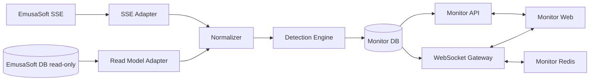

# Monitor: arquitectura de integración con EmusaSoft y roadmap de producción

**Sistema:** Monitor — Dashboard, Mensajes, Errores y Alertas
**Versión:** 1.0
**Estado:** arquitectura aprobada para iniciar la Fase 0
**Fecha de análisis:** 2026-07-19
**Fuentes principales:** catálogo MCP de EmusaSoft, esquema MySQL de producción extraído el 2026-07-16, documentación y prototipos del workspace, respuestas del arquitecto de EmusaSoft del 2026-07-19
**No incluye:** scaffold, código de aplicación, migraciones ejecutables ni cambios en EmusaSoft

## 1. Resumen de la decisión arquitectónica

Monitor debe construirse como una aplicación y servicio separados que se integran con EmusaSoft, no como lógica incrustada directamente en la base de datos productiva del ERP.

La arquitectura objetivo confirmada es:

1. Monitor es un sistema nuevo, con repositorio, despliegue y base de datos de control propios.
2. La base de datos de EmusaSoft es una fuente operacional externa de solo lectura. Monitor no escribe en ella.
3. Monitor consume directamente el stream SSE de EmusaSoft. EmusaSoft utiliza Redis como infraestructura realtime.
4. El contrato de eventos SSE se define desde los requerimientos funcionales de Monitor y se implementa como un contrato versionado entre ambos sistemas.
5. Un adaptador SSE normaliza los eventos de EmusaSoft; un lector SQL read-only reconcilia, completa contexto y recupera gaps.
6. Un motor de detección idempotente transforma evidencia de EmusaSoft en incidentes de Monitor.
7. La base propia de Monitor conserva reglas, eventos normalizados, cursores, incidentes, evidencia, conversaciones, mensajes, lecturas, entregas y auditoría.
8. Monitor utiliza WebSockets para la comunicación bidireccional con sus clientes: mensajes, recibos de lectura, presencia, escritura y actualizaciones del dashboard.
9. Redis de Monitor coordina fan-out, presencia y escalamiento horizontal de WebSockets. La base de datos, no Redis, es la fuente de verdad de mensajes e incidentes.
10. Una API de Monitor atiende consultas, recuperación de historial y comandos persistentes; el WebSocket distribuye cambios confirmados y señales efímeras.
11. Los registros operacionales se corrigen en EmusaSoft. Monitor conserva enlaces profundos y observa posteriormente la corrección.
12. Monitor ofrece una vista de todas las alertas `CLOSED_WITHOUT_RESOLUTION`, con evidencia, motivo, administrador y referencias operacionales suficientes para que el equipo de EmusaSoft evalúe ajustes posteriores.
13. Las regularizaciones de inventario, kardex valorizado o contabilidad quedan fuera del alcance de Monitor. Monitor no agenda, solicita ni ejecuta ajustes y nunca obtiene permisos de escritura sobre EmusaSoft.

### Estrategia técnica: diagnóstico, políticas y acciones

**Diagnóstico:** EmusaSoft ya contiene el registro operacional y emite realtime mediante SSE/Redis, pero Monitor es un sistema independiente y comunicacional. La brecha es una capa confiable que consuma eventos, reconcilie contra datos read-only, detecte divergencias, conserve evidencia y sostenga conversaciones bidireccionales. El riesgo principal es confundir el SSE de entrada con el canal WebSocket de clientes, depender de Redis como persistencia o interpretar timestamps de base de datos como eventos físicos.

**Políticas guía:** una sola fuente de verdad por dominio; escritura exclusivamente en la base de Monitor; lectura exclusivamente en EmusaSoft; ninguna integración de regularización; SSE para entrada desde EmusaSoft; WebSockets para interacción bidireccional con clientes; persistir antes de publicar; reconciliar todo stream; hacer detectores y comandos idempotentes, versionados y explicables; entregar primero reglas deterministas.

**Acciones:** formalizar los contratos SSE, SQL read-only y WebSocket; crear el repositorio y la base de Monitor; construir ingestión y reconciliación recuperables; entregar un vertical slice con A02/A03/A05; habilitar conversaciones bidireccionales; añadir la vista de cierres sin resolución; y después incorporar balances y modelos estadísticos. El kit mínimo propuesto es TypeScript, una API de Monitor, una base relacional, Redis y WebSockets; las librerías concretas se fijan en ADRs antes del scaffold.

## 2. Nivel de certeza

Las afirmaciones se clasifican así:

- **Confirmado:** visible directamente en el dump SQL, catálogo MCP o documentación aprobada.
- **Inferido:** conclusión técnica razonable basada en evidencia directa, pero sin acceso al archivo fuente que la implementa.
- **Pendiente:** no puede confirmarse con las fuentes disponibles.

El MCP disponible no expone archivos del repositorio ni dependencias, módulos, controladores, resolvers o infraestructura de despliegue. Expone un catálogo generado de GraphQL, entidades, tablas SQL, ejemplos y el sistema de UI. Las respuestas del arquitecto añaden cinco decisiones: EmusaSoft usa SSE y Redis; Monitor consumirá ese SSE directamente; el contrato se definirá según los requerimientos funcionales; Monitor tendrá repositorio y base propios; y su acceso a la base de EmusaSoft será de solo lectura. Siguen pendientes los detalles de endpoints, autenticación, payloads, garantías y topología, que se convierten en contratos de implementación de la Fase 0 y no cambian la arquitectura objetivo.

**Precedencia vigente:** la decisión de producto del 2026-07-19 elimina la cola y cualquier API de regularización. Si `docs/alert_catalog.md` todavía menciona una cola de ajustes durante su edición paralela, esa parte queda reemplazada por la vista read-only de cierres sin resolución definida aquí. Las reglas de detección y su evidencia continúan viniendo del catálogo vigente.

## 3. Fuentes inspeccionadas

### 3.1 EmusaSoft MCP

Catálogo versión 2, generado el 2026-07-13T08:16:37Z:

- 1,034 operaciones GraphQL.
- 345 entidades.
- 345 tablas SQL catalogadas.
- 1,034 ejemplos.

Superficies MCP usadas:

- `erp_get_catalog_info`
- `erp_search`
- `erp_describe`
- `erp_get_example`

Operaciones inspeccionadas:

- `getUserContext`
- `getSysUserById`
- `getUsers`
- `getRolesByUser`
- `getPermissionsByUserOrGroup`
- `getAvailableDocumentUsers`
- `getDocumentResponsibleUsers`
- `getSysCommentUsersByCommentId`
- `createSysCommentUser`
- `addSysReadUser`
- `notifyUsersInDocument`
- `pingActiveUser`
- `updateStateUser`
- `getWorkOrder`
- `getWorkOrderClosureById`
- `getWorkOrdersWithActiveFinalProcess`
- `getWorkProduction`
- `getWorkOrderMaterialStocksById`
- `getWorkOrderMaterialStockContainersConsumed`

Entidades inspeccionadas:

- `Document`
- `SysUser`
- `WorkProduction`
- `WorkOrder`
- `WorkOrderMaterialStock`
- `WorkOrderMaterialStockContainer`
- `MaterialFlow`
- `MaterialFlowDetail`
- `ArticleSerial`
- `ScaleLoad`
- `Warehouse`
- `Equipment`
- `ProductionSerial`

### 3.2 Base de datos extraída

Archivo: `local-data/database/prod_emusa_core-20260716-143040.sql`

- Dump de MySQL 8.0.45.
- Servidor de origen MySQL 8.0.43.
- Base: `prod_emusa_core`.
- Host de origen: RDS MySQL de producción en `us-east-1`.
- Charset y collation predominantes: `utf8mb4` y `utf8mb4_unicode_ci`.
- 363 sentencias `CREATE TABLE` en el dump.
- 361 claves primarias.
- 179 índices únicos.
- 718 índices secundarios.
- 803 restricciones de clave foránea.
- No se observaron definiciones `CREATE VIEW`, `CREATE TRIGGER`, `CREATE PROCEDURE`, `CREATE FUNCTION` o `CREATE EVENT` en el dump.
- Tablas sin clave primaria: `centro_costo_usuario` y `documento_relaciones`; ambas poseen índices compuestos, pero no PK formal.

El dump tiene 18 tablas más que el catálogo MCP. La explicación más probable es deriva entre el catálogo generado el 2026-07-13 y el dump del 2026-07-16. Antes de construir adaptadores se debe regenerar el catálogo o validar cada operación contra el esquema vigente.

### 3.3 Documentación y UX/UI del workspace

- `project_context.md`
- `dashboard_rationale.md`
- `docs/discovery.md`
- `docs/alert_catalog.md`
- `docs/design/design.md`
- `docs/design/brand_guidelines.md`
- `docs/design/design-system/tokens.json`
- `prototype/dashboard/`
- `prototype/alert-catalog/v1` a `v8`
- `prototype/chat-list-review/chat-list-final.html`
- `prototype/chat-list-review/chat-detail.html`
- `prototype/chat-list-review/dashboard.html`

## 4. Arquitectura observable de EmusaSoft

### 4.1 Capas confirmadas

| Capa | Evidencia | Conclusión |
|---|---|---|
| Cliente web | Rutas ERP, Storybook de Emusa UI y prototipos existentes | EmusaSoft es una aplicación web modular. |
| Contrato API | 1,034 operaciones GraphQL y ejemplos generados | GraphQL es la interfaz principal observable del ERP. |
| Modelo de dominio | 345 entidades GraphQL | La API expone entidades relacionales amplias, no únicamente DTOs planos. |
| Persistencia | Dump MySQL 8 con 363 tablas | MySQL es el sistema de registro principal observado. |
| ORM/migraciones | `_prisma_migrations` | Prisma administra al menos parte del esquema. |
| Autorización | tablas `sys_*`, recursos, grupos, roles, permisos y matrices | El acceso mezcla RBAC, agrupamiento y control por recurso. |
| Documentos/workflows | `documentos`, tipos, estados, etapas, responsables y logs | Existe un núcleo transversal de documentos y flujos de trabajo. |
| Comunicación saliente | `mensaje_flujos`, `mensaje_plantillas`, `notifyUsersInDocument` | EmusaSoft tiene una capa de plantillas y notificación multicanal. |
| Comentarios y lectura | `sys_comentarios`, `sys_comentario_usuarios`, `sys_lecturas`, `sys_lectura_usuarios` | Existen primitivas reutilizables para comentarios y recibos de lectura. |
| Presencia | `SysUser.state`, `pingActiveUser`, `updateStateUser` | La API modela usuario disponible, en pausa o desconectado. |

### 4.2 Lo que no está confirmado

- Framework backend exacto.
- Estructura de monorepo o repositorios.
- Límites reales entre servicios.
- Topología exacta de Redis y ownership de sus canales.
- Garantías del SSE: orden, duplicados, retención, replay y backpressure.
- Proveedor de identidad y protocolo exacto de login.
- Topología de despliegue, contenedores, ingress, balanceadores y autoscaling.
- Cache, colas, jobs y scheduler.
- Observabilidad y proveedor de logs/trazas.
- Endpoint, autenticación y payloads del SSE de EmusaSoft.
- Tecnología concreta del gateway WebSocket de Monitor.

No se encontró ninguna operación GraphQL de `subscription` ni resultados para `websocket`, `socket`, `realtime` o `subscription` en el catálogo. El arquitecto confirmó que el realtime de EmusaSoft es SSE con Redis; por tanto, no se debe buscar ni asumir un socket bidireccional de EmusaSoft para Monitor.

## 5. Núcleo transversal de documentos

La arquitectura de EmusaSoft se organiza alrededor de un documento genérico y entidades de módulo relacionadas.

### 5.1 `documentos`

`documentos` contiene:

- tipo y estado;
- código;
- planta;
- empresa y contacto;
- creador, actualizador, eliminador y finalizador;
- timestamps de creación, actualización, eliminación y finalización;
- banderas `eliminado`, `deshabilitado`, `solo_lectura`, `automatico` y `es_documento_raiz`;
- `id_recurso` para autorización por recurso;
- `id_lectura` para seguimiento de lectura;
- `id_adjunto` para adjuntos;
- `id_comentario` y `id_observacion` para conversaciones o anotaciones;
- relaciones padre, propietario, heredado y generado;
- estado anterior y tipo de documento destino.

Relaciones de dominio confirmadas en GraphQL:

- `Document.workOrder`
- `Document.scaleLoad`
- `Document.inventoryAdjustment`
- `Document.requestWaste`
- `Document.dispatchOrder`
- `Document.materialFlowDetails` mediante documentos disparadores
- otras superficies comerciales, compras, preprensa y despacho

### 5.2 Tipos, estados y etapas

`documento_tipos.codigo` incluye, entre otros:

- `MATERIALS_FLOW`
- `WORK_ORDER`
- `SCALE_LOAD`
- `INVENTORY_ADJUSTMENTS`
- `REQUEST_WASTE`
- `DISPATCH_ORDER`
- `DISPATCH_DELIVERY_NOTE`

Cada tipo se asocia con un tipo de flujo de trabajo, rol documental, icono, color y configuración de recursos o adjuntos.

`documento_estados` define el orden del estado, si bloquea el documento, si es terminal y si es un estado por defecto o endpoint.

`documento_estados_logs` conserva intervalos de estado con creador, inicio, finalizador y finalización.

`documento_detalles` conserva etapa, estado, artículo y tiempos de espera estimados, además de timestamps separados para creación y cambio de etapa.

`documento_logs` registra cambios de responsable, estado, actividad o información, con valor anterior, valor actual, comentario, actor, fecha y adjunto opcional.

### 5.3 Participación, responsabilidad y visibilidad

- `documento_usuarios`: requester o ejecutivo comercial.
- `documento_responsable`: responsable `DEFAULT`, `OPERATOR` o `SUPERVISOR`.
- `documento_responsable_tipo_config`: número de instancias permitido por tipo.
- `sys_visibilidad_matriz_tipodocumento_rol`: visibilidad por tipo, rol y estado.
- `sys_visibilidad_matriz_estadodocumento_etapa`: visibilidad y orden por etapa, tipo, transacción, estado, roles y tipos de usuario.
- `sys_matriz_flujotrabajotipos_rolparticipante`: participación por tipo de workflow y rol.

### 5.4 Implicación para Monitor

Monitor debe conservar referencias externas a `documentId`, `workOrderId`, `articleSerialId`, `materialFlowDetailId`, `scaleLoadId`, `warehouseId`, `equipmentId`, `factoryId` y `sysUserId`. No debe copiar documentos completos salvo snapshots mínimos de evidencia necesarios para auditoría.

Una alerta de Monitor no debe convertirse automáticamente en un nuevo `documentos` de EmusaSoft. Esa extensión requeriría agregar un tipo documental, estados, matrices, permisos y contratos GraphQL al ERP. Para v1 es más seguro mantener incidentes propios y enlazarlos con documentos ERP existentes.

## 6. Identidad, roles y autorización

### 6.1 Usuario y presencia

`sys_usuarios` y `SysUser` proporcionan:

- identidad interna numérica;
- `userAccountId` externo;
- nombre, apellido, correo y teléfono;
- usuario interno o externo;
- habilitado/deshabilitado y borrado lógico;
- estado `DISPONIBLE`, `EN_PAUSA` o `DESCONECTADO`;
- relaciones con planta, grupos, roles, recursos, documentos, comentarios y lecturas.

`getUserContext` retorna identidad, rol, `roleSlug`, `sysUserId`, datos adicionales, `sysUser` y `requiredPingActive`.

`pingActiveUser` y `updateStateUser` confirman un mecanismo de presencia a nivel de aplicación.

### 6.2 Modelo de permisos

| Tabla | Función |
|---|---|
| `sys_grupos` | Árbol de grupos globales, maestros, módulos, reportes, permisos, roles y utilidades. |
| `sys_grupo_usuarios` | Membresía usuario-grupo. |
| `sys_roles` | Roles con código estable y capacidad de agrupamiento. |
| `sys_role_asignamientos` | Asigna rol a usuario, grupo o ambos. |
| `sys_permisos` | Permisos `ADMIN`, `GRANT`, `ACCESO_TOTAL`, `EDITAR`, `VER`. |
| `sys_role_permisos` | Incluye o excluye permisos por rol. |
| `sys_recursos` | Recursos de compañía, documento, grupo o almacén. |
| `sys_recurso_compartidos` | Comparte recursos con grupo o usuario como ver, editar o acceso total. |
| `sys_control_accesos` | Permisos JSON por recurso y usuario. |
| `planta_usuarios` | Limita o asigna usuarios a plantas. |

Operaciones GraphQL relevantes:

- `getRolesByUser(userId)`
- `getPermissionsByUserOrGroup(groupIds, userIds, includePermissionsIds)`
- `getAvailableDocumentUsers`
- `getDocumentResponsibleUsers`

### 6.3 Política de autorización para Monitor

1. Monitor no duplica la identidad operacional: cada usuario autenticado se mapea a un `sysUserId` de EmusaSoft.
2. El mecanismo de autenticación —SSO, token exchange u otro— se decide mediante ADR antes del scaffold; Monitor no crea contraseñas mientras exista una integración corporativa soportada.
3. El backend de Monitor resuelve y verifica `sysUserId` en cada sesión.
4. La autorización se calcula en servidor; el navegador no decide acceso.
5. El usuario debe pertenecer a una planta autorizada.
6. La visibilidad de incidentes se deriva de planta, operación, máquina, almacén, grupo, rol y participación específica.
7. El gerente de planta ve todos los incidentes de su planta.
8. Supervisores y líderes ven las operaciones bajo su responsabilidad.
9. Operadores y personal de proceso ven conversaciones o incidentes donde son participantes resueltos.
10. La misma persona encontrada por varios caminos se deduplica por `sysUserId`.
11. Los ejemplos de personas incluidos en `docs/alert_catalog.md` no se codifican como destinatarios.

La “zona de influencia” usada en el catálogo de alertas no aparece como tabla ni operación explícita en el catálogo MCP actual. Antes de producción se debe confirmar si se representa mediante grupos, recursos de almacén, configuración externa o código no catalogado.

## 7. Mensajes, comentarios, lecturas y notificaciones

### 7.1 Comunicación saliente existente

`mensaje_flujos` define flujos de notificación con:

- nombre del evento;
- canal `EMAIL`, `WHATSAPP` o `SMS`;
- origen objetivo, incluidos `DOCUMENT`, `WORK_ORDER`, `ARTICLE_SERIAL`, `REQUEST_WASTE` y `WORK_PRODUCTION`.

Flujos existentes relevantes para Monitor:

- `NOTIFY_DOCUMENT_TRUNCATE`
- `WORK_ORDER_TRUNCATED`
- `MACHINE_PAUSED_LACK_OF_SUPPLIES`
- `PRODUCTION_PLAN_CHANGED_LACK_OF_SUPPLIES`
- `WORK_ORDER_CONSUMPTION_DIFFERENCE`
- `WORK_ORDER_CONSUMPTION_ADJUSTMENT_REQUIRED`
- `WORK_ORDER_CONSUMPTION_ADJUSTED`
- `ARTICLE_SERIAL_OBSERVED`
- `LAMINATING_PENDING_BALANCE`
- `WORK_PRODUCTION_APPROVAL_REQUEST`
- `WORK_PRODUCTION_REJECTED`

`mensaje_plantillas` une un flujo con una plantilla y JSON de entrada personalizada.

`notifyUsersInDocument(documentId, userReceivedId, event)` confirma que existe una mutación para notificar usuarios vinculados con documentos. Su implementación y garantía de entrega no son visibles.

### 7.2 Comentarios y lectura existentes

`sys_comentarios` es un contenedor con tipo `COMENTARIO` u `OBSERVACION`.

`sys_comentario_usuarios` almacena:

- contenedor de comentario;
- usuario;
- texto de hasta 500 caracteres;
- archivo opcional;
- borrado lógico;
- actor y timestamps de creación, actualización y eliminación.

Operaciones relevantes:

- `getSysCommentUsersByCommentId`
- `createSysCommentUser`
- `editSysCommentUser`
- `deleteSysCommentUser`

`sys_lecturas` es un contenedor y `sys_lectura_usuarios` vincula lectura con usuario y auditoría. `addSysReadUser` agrega la lectura.

### 7.3 Límite de reutilización

Las primitivas existentes sirven para comentarios asociados a documentos, pero no cubren explícitamente todas las capacidades diseñadas para Monitor:

- conversaciones por máquina, operación, turno o persona;
- múltiples incidentes adjuntos a una conversación;
- respuesta a un mensaje;
- reacciones;
- mensajes fijados o destacados;
- reenvío;
- mensajes privados;
- edición y borrado con historial;
- estado enviado, entregado y leído por destinatario;
- adjuntos con metadata de seguridad;
- mensajes generados por el sistema y versiones de su plantilla.

Forzar esas capacidades dentro de `sys_comentarios` produciría acoplamiento y semántica ambigua. Monitor debe tener un modelo de conversación propio, conservando `sysUserId` y referencias ERP.

### 7.4 Modelo recomendado de conversación

| Entidad | Campos esenciales |
|---|---|
| `monitor_conversation` | id, type, factory_id, operation_id, equipment_id, warehouse_id, shift_key, direct_pair_key, title, status, created_at, archived_at |
| `monitor_conversation_participant` | conversation_id, sys_user_id, role, joined_at, left_at, muted_until, notification_level |
| `monitor_message` | id, conversation_id, sender_sys_user_id, type, body, reply_to_id, forwarded_from_id, incident_id, client_message_id, created_at, edited_at, deleted_at |
| `monitor_message_attachment` | message_id, storage_key, filename, mime_type, size, checksum, scan_status |
| `monitor_message_receipt` | message_id, sys_user_id, delivered_at, read_at |
| `monitor_message_reaction` | message_id, sys_user_id, reaction, created_at |
| `monitor_message_pin` | message_id, conversation_id, pinned_by, pinned_at |
| `monitor_user_star` | message_id, sys_user_id, created_at |

Reglas:

- `client_message_id` es único por remitente para evitar duplicados en reconexiones.
- Mensajes de sistema sólo se crean desde eventos de incidente firmados por el backend.
- El borrado normal es lógico; la auditoría conserva actor y timestamp.
- Un mensaje no cambia la condición del ERP ni resuelve un incidente.
- Los recibos son por usuario, no un contador global.
- La conversación y el incidente se relacionan muchos-a-muchos mediante una tabla explícita si una conversación puede agrupar más de un incidente.

## 8. Modelo operacional relevante

### 8.1 Planta, operación, máquina, almacén y ubicación

- `plantas`: entidad organizativa superior.
- `planta_usuarios`: usuarios autorizados por planta.
- `operaciones`: códigos de operación, precedencias, sucesiones, unidad resultado, duración mínima, tolerancias, límite de merma y ordenamiento.
- `equipos`: máquina, código, capacidad organizativa, velocidad, dimensiones y estado.
- `operacion_equipos`: relación muchos-a-muchos operación-equipo.
- `almacenes`: almacén por planta, tipo, recepción, equipo asociado y recurso de autorización.
- `ubicaciones`: ubicación dentro de almacén, rol `INPUT`, `OUTPUT` o `STORAGE`, capacidad y contenedor de extrusión.

Relación importante: un almacén puede apuntar a un equipo mediante `almacenes.id_equipo`. Esa es la unión confirmada que permite resolver máquina hacia almacén. No confirma por sí sola la zona de influencia ni el turno activo.

### 8.2 Producción y orden de trabajo

`ordenes_produccion` / `WorkProduction`:

- código, estado y tipo;
- plan y ejecución;
- planta;
- cantidad planificada y metros;
- resultado de producción;
- estructura;
- comentario, adjunto, revisiones y logs;
- relación padre-hijos;
- colección de órdenes de trabajo.

`ordenes_trabajo` / `WorkOrder`:

- pertenece a producción, operación, equipo y documento;
- secuencia y código;
- fechas planificadas, ejecución, inicio efectivo, inicio de cierre y fin;
- cantidades planificadas, metros y millares;
- material planificado y consumido, incluidos valores ERP;
- tolerancias de bobina;
- truncamiento, pausa, cierre y usuario de cierre;
- orden anterior y operación siguiente;
- relaciones con materiales, flujos, salidas, seriales, stocks, logs y pre-reservas.

`getWorkOrder(workOrderId)` devuelve una agregación amplia con documento, materiales, producción, operación, equipo, salidas, seriales, stocks, OTs vecinas, usuarios de cierre/truncamiento y resumen. Es el mejor punto de partida confirmado para el snapshot de una OT, pero no sustituye consultas incrementales ni eventos.

### 8.3 Reserva, stock y consumo

- `pre_reserva_orden_trabajo`: enlaza OT origen y destino, material, stock, artículo y estado `PENDIENTE` o `COMPLETADO`.
- `orden_trabajo_material_stock`: demanda planificada y pendiente por OT, artículo, unidad, estructura y tipo.
- `orden_trabajo_material_stock_contenedores`: contenedor, ubicación, inventario actual, cierre real/ideal, vacío, fecha y usuario.
- `orden_trabajo_materiales`: artículo/serial/lote de la OT, tipo planificado/distribuido/no planificado, cantidades entrante/devuelta/consumida, metros, millares, reserva, cierre y origen de consumo.

La base confirma que el consumo puede ser trazado a serial, ubicación, stock, contenedor, pre-reserva y usuario creador. Para alertas temporales debe verificarse si `fecha_creacion` representa el instante operacional o únicamente persistencia.

### 8.4 Flujo de materiales

`flujo_materiales` tiene un documento único y jerarquía padre/raíz.

`flujo_materiales_detalles` contiene:

- artículo, serial y lote;
- cantidades iniciales, en tránsito y recibidas;
- unidad de uso e inventario;
- almacén y ubicación origen/destino;
- OT y material de OT;
- estado `TRANSITO`, `RECIBIDO`, `RECHAZADO` o `ANULADO`;
- receptor y fecha de recepción;
- documentos disparadores;
- jerarquía padre-hijos;
- timestamps y usuarios de auditoría.

Esta tabla es la fuente principal para A02 y parte de A01/A05.

### 8.5 Producción declarada, serial y pesaje

`orden_trabajo_salidas` contiene salida planificada y resultante, metros, tipo, gramaje, ancho, reservas y contadores de bultos observados, pesados y sin pesar.

`orden_trabajo_salida_detalles` identifica salida, artículo, cantidad, pesado, observado, parcial y actor.

`articulo_serial` es el registro de trazabilidad de bobina o material:

- código serial único;
- cantidades inicial y disponible;
- almacén y ubicación;
- estado, incluido `CONFIRMAR_PESO`;
- tipo `PRODUCTO_EN_PROCESO`, `ARTICULO`, `MERMA`, `SALDO` o `SOBRANTE`;
- OT actual, OT origen, salida, operación objetivo, serial padre y último cierre;
- ancho, gramaje, metros, área y dimensiones;
- escaneo y usuario;
- borrado y auditoría.

`balanza_cargas` se vincula uno-a-uno con `documentos` y almacena modo de pesaje, pesos de tara, bruto, neto, almacén y ubicación.

`balanza_carga_detalle_registros` se vincula de forma única con `articulo_serial` y guarda peso neto, tara, bruto, tipo `BOX` o `REEL`, salida y auditoría.

### 8.6 Pausas, cierre y plausibilidad

- `equipo_pausa`: equipo, usuario, estado, pausa manual/automática, inicio, reanudación y OT origen.
- `orden_trabajo_etapa_logs`: cambio de etapa por cierre o pausa.
- `ordenes_produccion_logs`: cambio de estado o información.
- `documento_logs` y `documento_estados_logs`: historial transversal.
- `operaciones.velocidad_maquina`, `min_duracion_proceso_min`, tolerancias y umbral de merma: parámetros base para reglas C y D.

## 9. Patrones y riesgos del esquema productivo

### 9.1 Patrones que Monitor debe respetar

- IDs numéricos enteros.
- Fechas con milisegundos mediante `datetime(3)`.
- Borrado lógico con `eliminado`, usuario y fecha.
- Auditoría por creador, actualizador y eliminador.
- Enums de MySQL para estados estables.
- Claves foráneas e índices explícitos.
- JSON para configuraciones flexibles, no para relaciones centrales.
- Relaciones GraphQL que agregan modelos amplios.

### 9.2 Riesgos que no se deben copiar sin revisión

- `double` aparece en dinero, cantidades y medidas. Monitor debe usar `DECIMAL` para valores auditables y fórmulas de balance.
- Fechas MySQL sin zona horaria. Monitor debe almacenar UTC y conservar la zona de presentación; la planta de Lima usa `America/Lima`.
- Timestamps no siempre indican evento físico; pueden indicar persistencia.
- Algunos actores se guardan como enteros y otros como strings externos.
- Soft delete y estado pueden coexistir; las consultas deben filtrar ambos correctamente.
- Enums de base requieren migraciones para nuevos valores.
- Dos tablas no tienen PK formal.
- El dump contiene datos productivos y secretos operacionales potenciales; no debe cargarse en CI, repositorios remotos ni entornos compartidos.
- El catálogo MCP está desfasado respecto del dump.

## 10. Arquitectura objetivo de Monitor

### 10.1 Componentes

| Componente | Responsabilidad |
|---|---|
| Monitor Web | Dashboard, lista de conversaciones, detalle, evidencia y enlaces ERP. |
| Monitor API | Contrato de UI, autorización, consultas, historial y comandos persistentes. GraphQL o REST se decide por ADR. |
| Identity Adapter | Autentica al usuario según el contrato que se defina y lo mapea al usuario y scopes operacionales de EmusaSoft. |
| Emusa Read Model Adapter | Consulta la base de EmusaSoft con credenciales estrictamente read-only para snapshots, reconciliación y contexto. |
| Emusa SSE Adapter | Mantiene la conexión SSE directa, valida el contrato, registra cursores y normaliza eventos. |
| Normalizer | Convierte payloads ERP en eventos canónicos de Monitor. |
| Detection Engine | Evalúa reglas deterministas, de deadline y estadísticas. |
| Incident Service | Deduplica, actualiza, correlaciona, resuelve y audita incidentes. |
| Routing Service | Resuelve destinatarios por planta, OT, turno, actor, operación, máquina y almacén. |
| Conversation Service | Conversaciones, mensajes, adjuntos, lecturas, reacciones y mensajes del sistema. |
| Notification Worker | Entrega in-app y, cuando corresponda, email, WhatsApp o SMS mediante proveedores propios de Monitor. |
| Unresolved Closure Read Model | Proyecta y filtra alertas cerradas sin resolución para revisión del equipo de EmusaSoft. |
| WebSocket Gateway | Recibe señales bidireccionales y distribuye cambios autorizados a clientes conectados. |
| Redis de Monitor | Coordina fan-out, presencia y escalamiento del gateway; no conserva el historial canónico. |
| Scheduler | Checkpoints de tiempo, reevaluaciones, escalación y reconciliación. |
| Monitor DB | Estado propio, auditoría, cursores, reglas, incidentes y mensajes. |
| Observability | Métricas, logs estructurados, trazas, healthchecks y registro de jobs fallidos. |

### 10.2 Diagrama de contexto

### 10.3 Flujo de datos

1. Un cambio ocurre en EmusaSoft y se publica por SSE mediante su infraestructura Redis.
2. Emusa SSE Adapter consume directamente el stream, valida la versión y registra el cursor recibido.
3. El normalizador crea un evento canónico con `source`, `source_id`, `occurred_at`, `observed_at`, `version` y payload mínimo.
4. Monitor persiste el evento de entrada con una clave idempotente antes de procesarlo.
5. Si el payload está incompleto o existe un gap, Emusa Read Model Adapter consulta la base read-only y reconcilia una ventana acotada.
6. El motor selecciona reglas por tipo de evento y checkpoints activos.
7. Cada regla produce `pass`, `warning`, `possible_error`, `error` o `insufficient_evidence`.
8. Incident Service busca la clave de incidente y crea o actualiza una sola cadena.
9. Se persiste evidencia inmutable y snapshot de versión de regla.
10. Routing Service resuelve participantes nominales y deduplica usuarios.
11. Se escribe un mensaje de sistema en la conversación correspondiente y se programan las notificaciones permitidas.
12. Después del commit, el gateway WebSocket publica el cambio sólo a sesiones autorizadas mediante Redis de Monitor.
13. Los comandos del cliente entran por API o WebSocket, se validan y persisten antes de emitir su confirmación.
14. Cuando nueva evidencia hace pasar la regla, el incidente se marca resuelto automáticamente.
15. Las alertas cerradas sin resolución quedan disponibles inmediatamente en una vista read-only para que el equipo de EmusaSoft determine cualquier acción fuera de Monitor.

### 10.4 Regla de frontera de datos

- **EmusaSoft:** fuente de verdad de OT, movimientos, consumos, producción, seriales, pesajes y demás datos operacionales.
- **Monitor:** fuente de verdad de definiciones de regla, evaluaciones, incidentes, evidencia congelada, conversaciones, mensajes, lecturas, entregas y cierre administrativo.
- **No permitido:** escritura directa desde Monitor en tablas productivas de EmusaSoft.
- **Acceso permitido:** SSE de EmusaSoft y consultas SQL con un usuario read-only; nunca desde el navegador.
- **Regularización:** fuera del alcance de Monitor; el equipo de EmusaSoft decide y ejecuta cualquier ajuste usando sus propios procesos.
- **Redis:** transporte y coordinación efímera; nunca fuente de verdad operacional ni comunicacional.
- **Corrección:** se realiza en EmusaSoft y Monitor observa el cambio.
- **Cierre sin resolución:** sólo cambia el estado administrativo en Monitor y conserva que la regla ERP continuó fallando.

## 11. Modelo de incidentes

### 11.1 Entidades recomendadas

| Entidad | Propósito |
|---|---|
| `monitor_rule_definition` | Código vigente del catálogo, versión, categoría, certeza, parámetros y estado. |
| `monitor_rule_parameter` | Parámetro por planta, operación, máquina o regla con vigencia. |
| `monitor_source_event` | Evento canónico idempotente recibido del ERP. |
| `monitor_evaluation` | Resultado de evaluar regla, entradas, fórmula, salida y duración. |
| `monitor_incident` | Incidente deduplicado y estado actual. |
| `monitor_incident_subject` | Referencias a OT, serial, material, flujo, máquina, almacén y documento. |
| `monitor_incident_evidence` | Evidencia inmutable y snapshot explicable. |
| `monitor_incident_transition` | Historial completo de estados y actor. |
| `monitor_incident_relation` | Causa, consecuencia, reemplazo, correlación o duplicado. |
| `monitor_incident_recipient` | Destinatario resuelto, razón y prioridad. |
| `monitor_admin_closure` | Motivo, comentario, administrador, cadena y evidencia preservada. |
| `monitor_detector_cursor` | Cursor por fuente y detector. |
| `monitor_delivery` | Entrega por canal, intentos, proveedor, estado y error. |

### 11.2 Clave de deduplicación

La clave debe ser determinista y versionada:

`factory + rule_family + work_order + primary_subject + workflow_stage + rule_generation`

`primary_subject` puede ser serial, material requerido, máquina, contenedor o par de OTs. La clave concreta se define por regla.

Reglas de correlación:

- A01 cambia de razón en los checkpoints de 60 y 30 minutos; no crea un segundo incidente.
- A03 se cierra con el primer consumo válido y se suprime cuando A07 aporta evidencia más fuerte.
- D03 se suprime cuando A03, A04, A05, A06, A07, D01 o D02 explica el mismo balance.
- Una regla determinista reemplaza o enriquece una advertencia estadística genérica.
- Un evento histórico ya cerrado sin resolución no reabre; un evento nuevo crea otra generación.

### 11.3 Estados

Estados técnicos recomendados:

- `APPROACHING_DEADLINE`
- `POSSIBLE_ERROR`
- `ERROR`
- `RESOLVED`
- `CLOSED_WITHOUT_RESOLUTION`
- `SUPPRESSED_BY_SPECIFIC_INCIDENT`
- `INVALIDATED`

`RESOLVED` sólo ocurre cuando la condición vuelve a pasar. `CLOSED_WITHOUT_RESOLUTION` requiere autorización, razón estandarizada, comentario, actor, timestamp y evidencia. Ninguno modifica registros ERP.

### 11.4 Vista de cierres sin resolución

La vista debe mostrar, como mínimo:

- ID, regla, estado, motivo, comentario, administrador y fecha de cierre;
- planta, OT, documento, material, reel, máquina, almacén y ubicación relacionados;
- condición detectada, valores observados, diferencia y unidades;
- evidencia congelada y enlaces profundos hacia EmusaSoft;
- incidentes correlacionados y cadena de cierre;
- filtros por fecha, planta, regla, OT, material, máquina y administrador;
- búsqueda, ordenamiento, paginación y exportación controlada.

La vista es informativa y read-only. No contiene botones para ajustar, aprobar, enviar, reintentar ni marcar una regularización como ejecutada. Cualquier proceso posterior pertenece a EmusaSoft.

### 11.5 Evidencia explicable

Cada evaluación debe guardar:

- versión de regla;
- parámetros efectivos y su fuente;
- IDs ERP usados;
- timestamps `occurred_at`, `observed_at` y `evaluated_at`;
- fórmula legible;
- valores, unidades y tolerancias;
- eventos SSE y consultas read-only usados, sin credenciales;
- hash del snapshot;
- resultado y nivel de confianza;
- razón de evidencia insuficiente, si aplica.

## 12. Mapeo de reglas a fuentes

| Regla | Fuentes principales | Tipo | Bloqueador previo a producción |
|---|---|---|---|
| A01 | OT planificada, `pre_reserva_orden_trabajo`, stock, `flujo_materiales_detalles` | Deadline/determinista | Confirmar disponibilidad, compra pendiente y timestamp de despacho. |
| A02 | `flujo_materiales_detalles` | Determinista | Confirmar instante de envío y exclusión de movimientos no ligados a OT. |
| A03 | `ordenes_trabajo`, `orden_trabajo_materiales` | Determinista | Confirmar estado activo y timestamp del primer consumo. |
| A04 | consumos, salidas, seriales, pesajes, merma, capacidad rebobinador | Inferida | Fuente de capacidad y tolerancia estadística. |
| A05 | `articulo_serial`, salidas, pesaje, flujo y ubicación | Deadline/determinista | Definir si pesaje y movimiento son deadlines independientes y timestamp de pickup. |
| A06 | salidas tipo merma, `solicitudes_merma`, seriales y pesaje | Mixta | Señal de bolsa cerrada no declarada. |
| A07 | consumos, producción buena, merma y pesajes | Mixta | Tolerancia, pesos verificados y tratamiento de estimaciones. |
| B01 | OT, plan aprobado y versiones/secuencia | Determinista | Fuente exacta de “último plan aprobado”. |
| B02 | fechas planificadas/ejecutadas, pausa, plan | Deadline | Política de reprogramación y tolerancia. |
| B03 | equipo, OT activa, pausas y plan | Deadline | Definir intervalo esperado y estados que excluyen alerta. |
| C01 | `balanza_carga_detalle_registros`, serial, salida, OT, equipo | Estadística/física | Segmentación, mínimo de muestra y hard limits. |
| C02 | merma, pesaje, matriz de waste y histórico | Estadística | Confirmar joins de matriz y versión del baseline. |
| C06 | OT inicio/fin, `equipo_pausa`, metros/kg, velocidad máquina | Estadística/física | Confirmar pausas completas y unidades. |
| D01 | OT cierre, materiales consumidos, peso/ancho/gramaje | Determinista con tolerancia | Fórmula, core, remanentes y unidades. |
| D02 | reserva, recepción, consumo, producción completa y truncamiento | Determinista | Criterio exacto de “producción completa”. |
| D03 | input, buena producción, merma y pesajes | Mixta | Validar tolerancia inicial de 5% y estimaciones sin peso. |
| E01 | receta, OT futuras, almacén de seguridad, stock | Deadline | Confirmar mapeo máquina-almacén y query de stock. |
| E02 | receta, contenedores y snapshot de apertura | Determinista | Confirmar campo inmutable de apertura; si no existe, requiere cambio ERP. |
| E03 | cierre de contenedor, apertura siguiente, movimientos | Determinista | Depende del snapshot inmutable de E02. |
| E04 | receta snapshot, apertura, adiciones, cierre y tornillo | Mixta | Confirmar todos los eventos por resina/tornillo y tolerancia. |

## 13. Estrategia de ingestión y tiempo real

### 13.1 Entrada desde EmusaSoft: SSE

Monitor consumirá directamente el SSE de EmusaSoft. El contrato mínimo que debe definirse antes de implementar contiene:

- endpoint y autenticación de servicio;
- `event_id` globalmente único o clave equivalente;
- tipo y versión del evento;
- `occurred_at` en origen y `published_at`;
- entidad, ID y planta afectada;
- payload mínimo o referencia suficiente para consultar contexto;
- semántica de `Last-Event-ID`, retención y replay;
- política explícita de orden y duplicados;
- heartbeats, timeout, reconexión y backoff;
- ambientes, ownership y procedimiento de cambio de versión.

El adaptador debe asumir entrega al menos una vez: deduplicar por `event_id`, tolerar reordenamiento y persistir antes de cualquier procesamiento o publicación downstream. SSE no ofrece confirmación por mensaje. Si EmusaSoft no ofrece replay suficiente, Monitor recupera el gap mediante reconciliación read-only.

### 13.2 Reconciliación contra la base read-only

El SSE reduce latencia, pero no demuestra por sí solo completitud. Monitor debe:

- consultar desde backend con un usuario SQL sin permisos de escritura;
- preferir una réplica read-only cuando EmusaSoft la tenga disponible;
- persistir cursores y checkpoints por dominio;
- reconciliar ventanas recientes y periodos posteriores a downtime;
- reevaluar deadlines mediante scheduler aunque no llegue un evento;
- usar índices y consultas incrementales acotadas;
- aplicar backoff, jitter, límites de concurrencia y query timeouts;
- medir retraso, gaps, duplicados y divergencias entre SSE y base.

No se permite scraping, acceso SQL desde el navegador ni polling completo de tablas. GraphQL puede usarse como herramienta complementaria de validación, pero no es la frontera runtime confirmada para la ingestión.

### 13.3 Salida e interacción con clientes: WebSockets

El contrato de clientes es propio de Monitor y distinto del SSE de EmusaSoft:

- `incident.created`
- `incident.updated`
- `incident.resolved`
- `message.created`
- `message.updated`
- `receipt.updated`
- `presence.updated`
- `source.freshness.changed`

El cliente se suscribe por usuario y scopes autorizados. Los mensajes y recibos se aceptan sólo después de autenticación y autorización server-side. Cada comando persistente lleva `client_message_id` o clave idempotente. Tras reconectar, el cliente envía su último cursor, recupera el gap por API y reanuda el stream. Nunca se confía sólo en WebSockets para consistencia.

Redis de Monitor distribuye eventos entre instancias y mantiene presencia efímera. El historial y los estados confirmados viven en Monitor DB. El Redis usado internamente por EmusaSoft no se considera compartido con Monitor salvo contrato operativo explícito.

## 14. API recomendada de Monitor

GraphQL es una opción coherente con EmusaSoft, pero no es una restricción impuesta al nuevo sistema. La Fase 0 decidirá GraphQL o REST con un criterio simple: escoger el contrato que el equipo pueda operar y probar con menor complejidad. Las capacidades mínimas son las mismas en ambos casos.

Queries mínimas:

- `monitorContext`
- `incidents(filter, page)`
- `incident(id)`
- `conversations(filter, page)`
- `conversation(id, after)`
- `unreadCounts`
- `ruleDefinitions`
- `sourceFreshness`

Mutations mínimas:

- `sendMessage`
- `editMessage`
- `deleteMessage`
- `markConversationRead`
- `reactToMessage`
- `pinMessage`
- `starMessage`
- `closeIncidentWithoutResolution` sólo si se aprueba para la primera versión
- `reopenAdministrativeClosure` sólo para administradores y con auditoría

Las operaciones de corrección de OT, material, consumo, producción o pesaje no pertenecen a Monitor v1.

## 15. Seguridad y privacidad

- Las credenciales SSE y SQL de EmusaSoft sólo viven en backend o secret manager.
- El navegador nunca recibe credenciales de servicio.
- Acceso de base de datos productiva: ninguno desde la UI; read-only desde adaptadores autorizados.
- Least privilege para SSE, API y bases de datos.
- TLS en tránsito y cifrado en reposo.
- Separación de ambientes y secretos.
- Logs sin tokens, cuerpos sensibles ni PII innecesaria.
- Sanitización de texto y archivos.
- Antivirus/scan para adjuntos.
- Rate limits para mensajes, búsquedas y mutaciones.
- Auditoría inmutable para cierre administrativo, cambios de regla y destinatarios.
- Retención definida para mensajes, evidencia y entregas.
- Exportación de cierres sin resolución restringida por rol, auditada y sin credenciales ni PII innecesaria.
- Backups y pruebas periódicas de restauración.
- El dump de producción se mantiene fuera de Git y fuera de artefactos de CI.

## 16. Observabilidad y objetivos operativos

Métricas mínimas:

- retraso entre evento ERP y observación;
- retraso entre observación e incidente;
- edad del cursor por fuente;
- evaluaciones por regla y resultado;
- incidentes creados, actualizados, resueltos, suprimidos y cerrados;
- duplicados evitados;
- notificaciones intentadas, entregadas y fallidas;
- conexiones realtime y reconexiones;
- mensajes enviados, entregados y leídos;
- errores GraphQL por operación;
- jobs pendientes y fallidos;
- tiempo de respuesta p50/p95/p99;
- discrepancias detectadas en reconciliación.

SLOs propuestos para el piloto, pendientes de aprobación:

- 99.5% de disponibilidad mensual del Monitor.
- 95% de eventos soportados convertidos en evaluación en menos de 60 segundos.
- 99% de incidentes deterministas sin duplicación para la misma clave.
- 100% de transiciones y cierres administrativos auditados.
- Recuperación de gap después de reconexión sin pérdida de mensajes o incidentes.

## 17. Estrategia de pruebas

### 17.1 Contratos

- Snapshot de schema GraphQL de EmusaSoft.
- Validación de operaciones usadas por cada adaptador.
- Alertas cuando cambian campos, nullability, enums o argumentos.
- Compatibilidad con catálogo y esquema de base vigentes.

### 17.2 Detectores

- Fixtures anonimizados por regla.
- Pruebas de límites exactos de tiempo y tolerancia.
- Propiedades de idempotencia y deduplicación.
- Reordenamiento, duplicación y retraso de eventos.
- Corrección tardía y resolución automática.
- Supresión D03 por causa específica.
- Cambio de parámetros con vigencia temporal.

### 17.3 Integración

- EmusaSoft sandbox o respuestas grabadas autorizadas.
- Fallos de red, timeout, rate limit y schema drift.
- Reconciliación después de downtime.
- Resolución real de permisos y destinatarios.
- Notificaciones sin duplicar usuario por múltiples rutas.

### 17.4 Realtime y mensajes

- Reconexión y recuperación por cursor.
- Mensaje duplicado por retry del cliente.
- Lecturas por varios dispositivos.
- orden de mensajes con reloj desfasado;
- adjuntos inválidos y malware;
- permisos revocados mientras existe una conexión.

### 17.5 UX/UI

- Desktop y móvil.
- Teclado, foco, lectores de pantalla y reduced motion.
- Contraste y estados no dependientes del color.
- Expansión de español, inglés y portugués.
- Carga, vacío, error, offline, stale y reconexión.
- Volúmenes altos de incidentes y conversaciones.
- Filtros, paginación, permisos y exportación de la vista de cierres sin resolución.
- Verificación de que la vista no expone acciones de ajuste ni estados ficticios de regularización.

## 18. Roadmap de producción

Las duraciones son rangos de esfuerzo de un equipo pequeño multidisciplinario y no fechas comprometidas. Deben recalibrarse cuando se conozcan tamaño del equipo, ambientes y disponibilidad de EmusaSoft.

### Fase 0 — Contratos y decisiones de implementación

**Esfuerzo:** 1 semana
**Objetivo:** convertir la arquitectura confirmada en contratos implementables sin escribir todavía lógica de producto.

Entregables:

- ADR de frontera: EmusaSoft read-only y Monitor con repositorio y base propios;
- especificación versionada del SSE: endpoint, autenticación, eventos, payloads, cursores, replay y errores;
- contrato del acceso SQL read-only, preferentemente contra réplica;
- ADR de autenticación de usuarios y mapeo con `sysUserId`;
- ADR del kit técnico: runtime, framework API, motor de base, ORM, WebSocket y Redis;
- protocolo WebSocket de Monitor: autenticación, comandos, eventos, cursores e idempotencia;
- esquema del evento canónico y política de reconciliación;
- inventario de ambientes, secretos, ownership y límites operativos;
- threat model inicial y prueba de que las credenciales de EmusaSoft no llegan al navegador.

Gate de salida:

- un evento SSE de prueba puede mapearse en papel hasta un evento WebSocket y recuperarse por API;
- están aprobados los contratos de autenticación, SSE, SQL read-only y WebSocket;
- ninguna decisión crítica de transporte o persistencia queda implícita.

### Fase 1 — Contratos de datos y reglas

**Esfuerzo:** 2–3 semanas  
**Objetivo:** convertir las reglas vigentes de las familias A–E en especificaciones ejecutables.

Entregables:

- contrato de evento canónico;
- mapping de cada regla a evento SSE, tabla/campo read-only, join, unidad y timestamp;
- definición de clave de deduplicación por regla;
- parámetros versionados;
- fixtures anonimizados;
- matriz de evidencia suficiente/insuficiente;
- resolución formal de bloqueadores A04, A06, A07, B01, D01, E02–E04;
- clasificación final: determinista, deadline, física o estadística.

Gate de salida:

- cada regla candidata puede producir un resultado reproducible desde un fixture o queda explícitamente fuera del primer release.

### Fase 2 — Fundación de plataforma

**Esfuerzo:** 2–3 semanas  
**Objetivo:** crear el kit técnico sin lógica de negocio extensa.

Entregables:

- repositorio y pipeline CI;
- environments local, test y staging;
- API de Monitor según ADR;
- base relacional de Monitor y migraciones según ADR;
- identity adapter;
- autorización server-side;
- logging estructurado, métricas, tracing y healthchecks;
- secret management;
- Redis y gateway WebSocket con reconexión por cursor;
- feature flags.

Gate de salida:

- un usuario de staging se autentica, recibe scopes correctos y abre una sesión WebSocket sin exposición de credenciales;
- una prueba de permisos demuestra que Monitor no puede escribir en la base de EmusaSoft.

### Fase 3 — SSE, lectura y reconciliación

**Esfuerzo:** 2–4 semanas  
**Objetivo:** obtener evidencia confiable y repetible.

Entregables:

- consumidor SSE de EmusaSoft con validación de contrato y reconexión;
- adaptadores SQL read-only para OT, materiales, flujos, seriales, pesajes, pausas y usuarios;
- source event store idempotente;
- cursores, `Last-Event-ID`, retries, backoff, DLQ y reconciliación SQL;
- dashboard de frescura de fuentes;
- pruebas de drift del esquema y del contrato SSE.

Gate de salida:

- staging puede cortar SSE, omitir, duplicar y reordenar eventos y luego recuperar el estado correcto mediante idempotencia y reconciliación.

### Fase 4 — Vertical slice de incidentes

**Esfuerzo:** 2–3 semanas  
**Objetivo:** entregar una cadena completa con reglas de bajo riesgo.

Reglas iniciales recomendadas:

- A02 — material en tránsito más de 30 minutos;
- A03 — OT activa sin consumo después de 15 minutos;
- A05 — reel declarado sin pesaje o movimiento dentro del umbral;

Entregables:

- motor de reglas;
- incidente, evidencia, transición y deduplicación;
- resolución automática;
- correlación básica;
- API de incidentes;
- eventos WebSocket posteriores al commit;
- vista dashboard y drawer conectados a datos reales de staging.

Gate de salida:

- casos sintéticos y casos históricos anonimizados crean, actualizan y resuelven un solo incidente con evidencia explicable.

### Fase 5 — Routing y notificaciones

**Esfuerzo:** 2–3 semanas  
**Objetivo:** informar a las personas correctas, una sola vez.

Entregables:

- resolución OT → máquina → operación → turno → operador;
- máquina → almacén → configuración de influencia;
- gerente y supervisor por planta/operación;
- razones de routing auditadas;
- deduplicación de destinatarios;
- notificación in-app;
- proveedor propio de Monitor para cada canal externo aprobado;
- retry, delivery state y dead letters.

Gate de salida:

- pruebas de roster y permisos demuestran que no se notifica a toda una zona por defecto y que cada usuario recibe una sola entrega.

### Fase 6 — Conversaciones y mensajes

**Esfuerzo:** 3–5 semanas  
**Objetivo:** implementar las superficies de chat ya diseñadas.

Orden recomendado:

1. lista, búsqueda y filtros;
2. conversación y mensajes del sistema;
3. enviar, responder y lectura;
4. adjuntos;
5. reacciones, fijar y destacar;
6. reenvío y respuesta privada;
7. herramientas de moderación y auditoría.

Entregables técnicos:

- comandos WebSocket o API idempotentes para enviar y marcar lectura;
- eventos WebSocket para mensajes, recibos, presencia y escritura;
- persistencia transaccional antes del fan-out por Redis;
- recuperación paginada por API y cursor de sincronización;
- autorización por conversación en cada conexión y comando;
- soporte de reconexión y múltiples dispositivos sin duplicar mensajes.

Gate de salida:

- desktop y móvil pasan pruebas de permisos, reconexión, idempotencia, orden, accesibilidad y recuperación de mensajes por API.

### Fase 7 — Reglas de cierre y balance

**Esfuerzo:** 3–5 semanas  
**Objetivo:** agregar D01–D03 y reglas que requieren cálculos de unidades.

Entregables:

- biblioteca de unidades y precisión decimal;
- snapshots de parámetros y fórmulas;
- D01, D02 y D03;
- correlación y supresión de causas específicas;
- evidencia de peso real versus estimado;
- cierre administrativo si se aprueba su inclusión;
- vista read-only de cierres sin resolución con filtros, búsqueda, evidencia, referencias ERP y exportación controlada.

Gate de salida:

- expertos de proceso reproducen cada cálculo con datos de origen y aprueban tolerancias y explicaciones;
- el equipo de EmusaSoft puede localizar y comprender un cierre sin resolución sin acceso administrativo a Monitor.

### Fase 8 — Reglas estadísticas y específicas de operación

**Esfuerzo:** 4–8 semanas  
**Objetivo:** incorporar reglas de mayor incertidumbre sin degradar la confianza.

Entregables:

- C01, C02 y C06 con datasets y model versioning;
- A04 sólo después de confirmar capacidad de rebobinador;
- E01–E04 sólo después de resolver snapshots y eventos de contenedor;
- panel de calidad de modelo, tamaño de muestra y falsos positivos;
- backtesting y shadow mode.

Gate de salida:

- cada modelo cumple el umbral de precisión acordado en shadow mode y muestra nivel de confianza.

### Fase 9 — Piloto de planta

**Esfuerzo:** 3–4 semanas  
**Objetivo:** operar con usuarios reales sin depender de Monitor para ejecutar el proceso.

Entregables:

- capacitación breve por rol;
- runbook y soporte;
- on-call y escalación;
- dashboards de SLO;
- feedback diario;
- revisión de falsos positivos, falsos negativos y routing;
- rollback y kill switches por regla.

Gate de salida:

- SLOs del piloto, aceptación de usuarios y criterios de seguridad cumplidos durante una ventana acordada.

### Fase 10 — Producción y expansión

**Esfuerzo:** continuo  
**Objetivo:** endurecer y ampliar Monitor.

Entregables:

- rollout gradual por operación y planta;
- backups y restore test;
- disaster recovery;
- capacity testing;
- revisión de seguridad;
- gobierno de reglas;
- localización;
- nuevas integraciones y reglas aprobadas.

## 19. Orden recomendado de releases

### Release 0 — Shadow monitor

- Consumo SSE y reconciliación SQL read-only.
- Evaluación sin notificar usuarios.
- A02, A03 y A05.
- Comparación con hechos históricos.

### Release 1 — Monitor informativo

- Dashboard real.
- Incidentes y evidencia.
- Actualizaciones WebSocket del dashboard.
- Routing y notificación in-app.
- Enlaces a EmusaSoft.
- Sin correcciones de ERP desde Monitor.

### Release 1.1 — Mensajes

- Lista de conversaciones.
- Mensajes de sistema y humanos.
- Respuestas, lecturas y adjuntos.
- Funciones avanzadas bajo feature flags.

### Release 1.2 — Balance y cierre

- D01–D03.
- Cierre administrativo si se aprueba.
- Vista read-only de alertas cerradas sin resolución.
- Correlación avanzada.

### Release 2 — Estadística y operación específica

- C01, C02, C06, A04 y E01–E04 validadas.
- Modelos versionados y shadow mode.
- Posibles flujos de intervención, sólo con nueva aprobación de alcance.

## 20. Decisiones pendientes antes de escribir código

Estas decisiones pertenecen al equipo de Monitor o a Product; ya no requieren descubrir la arquitectura interna de EmusaSoft:

1. Endpoint, autenticación, payloads, cursores, replay y límites concretos del SSE.
2. Proveedor de identidad y mecanismo de sesión para usuarios de Monitor.
3. Runtime, framework API, motor de base, ORM y librería WebSocket del nuevo repositorio.
4. Fuente funcional de turnos, operador activo y zonas de influencia.
5. Permiso exacto que habilita acceso y administración en Monitor.
6. Política de retención de incidentes, mensajes, adjuntos y evidencia.
7. Canales externos del primer release.
8. Si `CLOSED_WITHOUT_RESOLUTION` entra en Release 1 o 1.2.
9. Funciones imprescindibles del chat en el primer release.
10. Reglas exactas del piloto y tolerancias todavía abiertas.
11. Equipo, ambientes y proceso de despliegue.

## 21. Definition of Done del primer release productivo

- Cada identidad autenticada se mapea a `sysUserId` y sus permisos se verifican en backend.
- No existe escritura directa a la base productiva de EmusaSoft.
- El contrato SSE y cada consulta SQL read-only usada tienen contract tests.
- La ingestión es idempotente, recuperable y reconciliable.
- Cada incidente tiene regla, versión, evidencia, timestamps, sujetos y destinatarios explicables.
- La regla de un incidente evita duplicados confirmados.
- La UI muestra error, por vencer, posible error, stale y offline sin depender sólo del color.
- La reconexión SSE recupera o reconcilia gaps y la reconexión WebSocket recupera eventos y mensajes faltantes por API.
- Las correcciones realizadas en EmusaSoft resuelven automáticamente el incidente cuando la regla vuelve a pasar.
- Los cierres administrativos, si están habilitados, son auditados y no alteran evidencia ERP.
- Monitor nunca tiene credenciales SQL de escritura sobre EmusaSoft.
- La vista de cierres sin resolución muestra evidencia, motivo, administrador y referencias ERP, con filtros y acceso read-only.
- Monitor no agenda, solicita ni registra como ejecutados ajustes de inventario, kardex o contabilidad.
- Las notificaciones registran intentos, entrega y error.
- Logs y trazas no exponen tokens ni datos sensibles innecesarios.
- Backups y restore test están aprobados.
- Alertas operacionales de Monitor tienen runbook y responsables.
- Piloto aprobado por fábrica, proceso, operaciones y tecnología.

## 22. Conclusión técnica

Monitor será un sistema completamente independiente con repositorio, servicio y base de control propios. Consume el SSE de EmusaSoft respaldado por Redis y utiliza acceso SQL read-only para contexto y reconciliación. Hacia sus clientes, Monitor expone una API recuperable y WebSockets bidireccionales respaldados por su propio Redis. EmusaSoft conserva la verdad operacional; Monitor conserva incidentes, comunicaciones y cierres administrativos.

Monitor sólo ofrece una vista read-only de alertas cerradas sin resolución. Cualquier ajuste posterior pertenece al equipo de EmusaSoft y queda fuera del alcance del proyecto. Antes del scaffold deben cerrarse autenticación, especificación SSE, consultas read-only, kit técnico y protocolo WebSocket.
